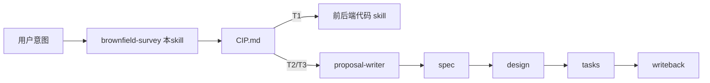

# 棕地项目维护 Skill 设计沟通记录与总体设计

> 本文档记录围绕「棕地工程（存量已有项目）bug 修复与功能新增 skill」的两轮批判性思考与最终设计。
> 沟通采用 `critical-thinking` skill 的「疑问还原 → 思考过程 → 独立观点 → 深度讲解」四段式，
> 输出形态为 spec_wf 体系的扩展插件，命名 `brownfield-survey-skill`，产物为 `cip.md`（Change Impact & Plan）。

---

## 一、沟通上下文总览

### 1.1 用户初始诉求（第一轮）

用户提供了一段约 6 KB 的「棕地项目多团队协作下的 AI 代码生成约束提示词」原稿，核心要素：

- **角色**：资深存量系统维护架构师
- **项目背景**：棕地、多团队、最小侵入式修改
- **六块强制约束**：
  1. 修改边界约束（禁止直接修改已有方法、禁止删除重命名 public 接口）
  2. 扩展策略优先级（新建文件 > 复用 > 继承 > 装饰器 > 策略+开关）
  3. 代码产出规范（变更清单 / 影响范围 / 复用说明 / 未修改证据 / 回滚方案）
  4. 注释与可追溯性（`@since/@author/@ticket` + `// [MODIFIED by ...]`）
  5. AI 自检清单（5 条）
  6. 禁止行为清单（顺手优化、升级依赖、跨域格式化等）
- **响应格式**：7 节固定模板（需求理解 / 方案选型 / 推荐方案 / 代码实现 / 变更清单 + 自检 / 风险提示）

诉求：基于 spec_wf 体系，把这套约束设计成 skill。

### 1.2 用户第二轮反馈（三点）

1. **加强人工确认审查**：修改确定前，若涉及对既有功能的重构 / 冲突 / 影响，必须先抛"确认点 + 影响评估"与人沟通，确认后才执行。要求专业简洁，不赘述。
2. **产物形态**：本 skill 的最终产物是一份「已确认的修改方案 md」，受众是架构师与 AI，要求专业简洁。
3. **定位再思考**：这份 md 既可作为 `proposal-writer-skill` 的输入，也可直接喂给前后端代码编写 skill；要求判定它接入 **proposal 还是 design** 更合理。

---

## 二、第一轮批判性思考摘要

### 2.1 关键假设与检验

| 假设 | 结论 |
|---|---|
| A：核心矛盾是「侵入边界」 | **部分成立**。仅"禁改已有方法"远不充分；还需 既有资产识别 + 追溯链 + 回滚 / 灰度 |
| B：值得独立成 skill | **成立但需重新定位**。spec_wf 已有 `change_mode: bugfix/refactor/extend` 整套契约 + §0 既有资产盘点 + 复用充分性自检三问 + 增量标注 5 项闭集，独立 skill 等于重造轮子 |
| C：自检清单是有效杠杆 | **必要不充分**。AI 自检在 one-shot 场景常被跳过；spec_wf 已有「validator 硬门 + critic 软门 + audit 钩子」三轨兜底 |

### 2.2 权威依据

- **OCP（开闭原则）**：不是"绝对禁改"，而是"让修改有边界、有路由、有保护"。
- **Working Effectively with Legacy Code（Feathers）**：棕地核心难题是"在无测试保护下安全改动"，对应解法是 **Seam（接缝点）识别 + Characterization Tests（特征测试）**——原提示词完全缺失。
- **Feature Toggles（M. Fowler 2017）**：未设过期的开关会变成"永久债务"。
- **CODEOWNERS / Chromium OWNERS**：多团队责任路由必须**机器可验证**，仅靠注释 `@author` 标注是事后审计。
- **spec_wf 既有契约**：
  - [`shared/contracts/change-verbs.md`](../spec_wf/shared/contracts/change-verbs.md) 9 词全集 + 5 处 sub-select
  - [`shared/contracts/frontmatter-schema.md`](../spec_wf/shared/contracts/frontmatter-schema.md) 已含 `change_mode/touched_capabilities/impacted_modules/reused_modules`
  - design 阶段已强制「复用充分性三问 ADR」
  - critic J2「增量诚实性」、J4「复用充分性」**就是为棕地设计的**

### 2.3 反例检验

- **反例 1（伪两难）**：配置加载顺序导致空指针，根因在 `ConfigLoader.load()` 内部。按原提示词应新建装饰器 → 但装饰器无法访问私有字段 → 被迫反射 → 触发"禁止隐式破坏"红线 → 死循环。结论：硬性"禁改已有方法"会制造伪两难。
- **反例 2（ceremony 过载）**：5 行的字段名 typo 修复，按规范要 7 节产出 → 仪式开销远大于实际改动。结论：必须按改动规模分级。

### 2.4 第一轮结论

原提示词「约束意图」对，但「独立成 skill」的形态错。正确做法是**收编为 spec_wf 的扩展插件**，并补齐：
- Seam 识别
- Characterization Test
- 回滚开关的 `expire_after` 强制
- Tier 分级（T1/T2/T3）解决 ceremony 问题

---

## 三、第二轮批判性思考摘要

### 3.1 核心判断：本 skill 应接入哪里？

| 候选 | 评价 | 决断 |
|---|---|---|
| **接入 proposal 之前（pre-proposal）** | proposal §0 本就要做既有盘点，但是"自填表"，没有"先与人确认"环节。前置成独立 skill = 把 §0 从"事后填表"升级为"事前对齐 + 证据驱动 + 用户确认" | ✅ **采纳** |
| 接入 proposal 与 design 之间 | proposal 已强制 §0 盘点，再插一层等于二次盘点（违反 DRY），且结论无法回填 proposal | ❌ 拒绝 |
| 接入 design 内部 | design 边界红线明确禁止"无 SQL/HTTP/字段类型/代码片段"（见 [`design-writer/SKILL.md`](../spec_wf/design-writer-skill/SKILL.md)），而修改方案必涉及具体方法/文件 → **直接违反 design 边界红线** | ❌ 拒绝 |

### 3.2 关键反假设

| 假设 | 结论 |
|---|---|
| 单一 md 同时喂 proposal 与代码 skill | **不成立**。proposal 战略层与代码 skill 执行层抽象差距两个阶段（中间还隔 spec、design）。解法：用 `feeds_into ∈ {dev_direct, proposal}` 字段分流 + Tier 分级填充 |
| 需要新造「人工确认」机制 | **不成立**。[`clarification-gate-protocol.md`](../spec_wf/shared/protocols/clarification-gate-protocol.md) 已是唯一权威 CG 协议，明确禁止复述。**复用 CG + 新增棕地专用题表**是唯一正解 |

### 3.3 反例确认 Tier 分级必要

- 反例 A（T1）：登录页"登陆 → 登录"错别字，强制走 proposal = ceremony tax
- 反例 B（T3）：5 模块 3 团队大型重构，仅一份 md 不足以指导落地

结论：必须 T1 旁路代码 skill，T2/T3 经 proposal。

---

## 四、最终设计：`brownfield-survey-skill`

### 4.1 定位

- **它是什么**：spec_wf 的 **pre-proposal 棕地勘察 skill**，产出「Change Impact & Plan（CIP）」。
- **它不是什么**：不是 proposal、不是 design、不是代码 skill；不替代任何阶段，只**前置补强**。
- **激活条件**：用户提出 bug 修复 / 功能新增 / 重构意图，且工程**非 greenfield**。greenfield 直接走 proposal-writer。

### 4.2 工作流位置



### 4.3 目录结构（遵循 spec_wf 四件套）

```
brownfield-survey-skill/
├── SKILL.md                # ≤65 行入口
├── README.md
├── templates/
│   └── cip.md              # Change Impact & Plan 模板（专业简洁，≤2 页）
└── references/
    ├── how-to-survey.md           # 4 步勘察法
    ├── impact-assessment.md       # 影响评估清单（侵入面 / 调用方 / 数据 / 接口 / 配置）
    ├── conflict-detection.md      # 冲突识别清单（与既有功能 / 在途变更）
    ├── confirmation-questions.md  # 棕地专用 CG 题表（复用 CG 协议）
    ├── invasion-ladder.md         # 5 级侵入阶梯（new_file→composition→inheritance→decorator→modify_existing）
    ├── seam-identification.md     # 接缝点识别清单
    ├── tier-routing.md            # T1/T2/T3 分级 + 下游路由规则
    ├── rollback-mechanics.md      # feature flag / 配置开关命名 + expire_after 强制
    ├── ownership-routing.md       # 与 CODEOWNERS 联动的责任路由（建议级，不替代治理）
    └── redlines.md                # 硬禁项（顺手重构 / 升级依赖 / 跨域格式化）
```

### 4.4 CIP.md 文档结构（专业简洁，≤2 页）

```yaml
---
name: brownfield-cip
change_name: {kebab-case}
status: draft | reviewed
change_mode: bugfix | extend | refactor
tier: T1 | T2 | T3
feeds_into: dev_direct | proposal      # 下游路由
invasion_tier: new_file | composition | inheritance | decorator | modify_existing
touched_assets:                        # 与 proposal §0.2 字段同构，便于素材直传
  - {path, kind, relation}
modified_existing_methods: []          # 含 {file, method, reason, owner_team, ticket}
seams: []                              # 接缝点清单（构造器注入 / 工厂替换 / 接口扩展）
characterization_tests: []             # 触达既有行为的特征测试
conflicts: []                          # 与既有功能 / 在途变更
rollback_switches: []                  # {key, default, owner, expire_after}
confirmation_state: aligned | pending  # 人工确认状态
---

<!-- clarification-gate ... verdict: PASS|ABORTED ... -->

# 1. 目标（≤3 句）
# 2. 既有资产盘点（表：path / kind / relation∈{沿用,扩展,修改,替换,废弃}）
# 3. 影响评估（表：维度 / 现状 / 变更后 / 影响范围 / 风险等级）
# 4. 冲突识别（与既有功能 / 在途 PR / 团队所有权）
# 5. 修改方案（侵入阶梯选择 + 关键决策 + Backout）
# 6. 确认结论（引用 <!-- clarification-gate --> 块的 verdict）
```

**专业简洁约束**：

- 每节最多 1 张表 + 3 行说明，禁止 ceremonial 段落
- T1 整文 ≤30 行（仅 §1/§2/§5/§6）
- T2 整文 ≤80 行（全 6 节）
- T3 整文 ≤120 行（全 6 节 + 团队对齐留痕）

### 4.5 人工确认机制（复用 CG 协议）

引用 [`clarification-gate-protocol.md`](../spec_wf/shared/protocols/clarification-gate-protocol.md) 作为唯一权威，**禁止复述步骤**。在 `references/confirmation-questions.md` 列出棕地专属 5 题：

| # | 问题 | 选项要点 |
|---|------|---------|
| Q1 | 本次改动的侵入阶梯？ | [a]new_file [b]composition [c]inheritance [d]decorator [e]modify_existing [f]AI推断 |
| Q2 | 是否存在与既有功能的语义冲突 / 替换 / 共存关系？ | [a]无 [b]替换 [c]共存 [d]AI推断 |
| Q3 | 是否触达跨团队代码（含 owner 列表）？ | [a]单团队 [b]跨团队(标注owner) [c]AI推断 |
| Q4 | 回滚机制？ | [a]feature flag [b]配置开关 [c]直接回退 [d]AI推断 |
| Q5 | 改动规模 Tier？（决定下游路由） | [a]T1 [b]T2 [c]T3 [d]AI推断 |

- 每题封闭式 + 必含「AI 默认推断」兜底
- CIP.md frontmatter 闭合后强制留 `<!-- clarification-gate -->` 块（stage: `brownfield-survey`）
- 留痕缺失 → 视为违反，下游 skill 应拒绝接收

### 4.6 Tier 分级路由（核心决策矩阵）

| Tier | 触发条件 | 产物厚度 | `feeds_into` | 下游 |
|------|---------|---------|-------------|-----|
| **T1** | ≤10 行 / 单文件 / 无跨团队 / `invasion_tier != modify_existing` | CIP ≤30 行，仅 §1/§2/§5/§6 | `dev_direct` | **直接喂代码 skill**，跳过 proposal |
| **T2** | ≤100 行 / 1–2 模块 / 单团队 | CIP ≤80 行，全 6 节 | `proposal` | proposal-writer 引 CIP 为 §0 素材包 |
| **T3** | >100 行 / 跨团队 / 含 `modify_existing` / 含 替换 或 废弃 | CIP ≤120 行 + 团队对齐留痕 | `proposal` | proposal-writer + 强制 critic |

> Tier 由 CG 第 5 题确认后写入 frontmatter，作为下游路由的唯一依据。

### 4.7 与 proposal-writer 的衔接契约

- 在 [`proposal-writer/SKILL.md`](../spec_wf/proposal-writer-skill/SKILL.md) 输入段新增：
  > 若 `docs/spec/{change_name}/cip.md` 存在且 `tier ∈ {T2, T3}`，则 §0.1 / §0.2 / §0.3 必须**引用** CIP 对应章节，不重复盘点。
- 字段直通：
  - `cip.touched_assets` → 候选 `proposal §0.2 impacted_modules`
  - `cip.invasion_tier` → proposal 决策前自检材料
  - `cip.modified_existing_methods` → 触发 proposal §2 `[BREAKING]` 候选标记
  - `cip.conflicts` → proposal §1 Problem 引证素材

### 4.8 与代码 skill 的衔接契约

- 代码 skill 在动手前**必须读** `cip.md` 的：
  - `modified_existing_methods`（确定可改边界）
  - `rollback_switches`（实现回退能力）
  - `seams`（采纳接缝点策略）
  - `characterization_tests`（先写特征测试再改）
- 每处实际修改在代码注释引用 CIP 章节：`// see cip.md §5 / ticket: XXX`，形成可追溯链
- 修改完成后，代码 skill 需在 CIP frontmatter 写回 `status: reviewed`（仅 T1 路径；T2/T3 由 proposal 接管）

### 4.9 frontmatter 字段扩展

向 [`frontmatter-schema.md`](../spec_wf/shared/contracts/frontmatter-schema.md) 新增（本 skill 专属，但通过统一 schema 注册）：

| 字段 | 写入者 | 语义 |
|------|--------|------|
| `tier` | brownfield-survey | `T1` \| `T2` \| `T3` |
| `feeds_into` | brownfield-survey | `dev_direct` \| `proposal` |
| `invasion_tier` | brownfield-survey | 5 级阶梯枚举 |
| `touched_assets` | brownfield-survey | 与 proposal §0.2 同构 |
| `modified_existing_methods` | brownfield-survey | 列表（含 owner_team / ticket） |
| `seams` | brownfield-survey | 接缝点清单 |
| `characterization_tests` | brownfield-survey | 特征测试用例 |
| `conflicts` | brownfield-survey | 冲突清单 |
| `rollback_switches` | brownfield-survey | 含 `expire_after` |
| `confirmation_state` | brownfield-survey | `aligned` \| `pending` |

### 4.10 validator 校验扩展（I-H 系列）

写入 [`scripts/validate.mjs`](../spec_wf/scripts/validate.mjs)：

- **I-H1**：`feeds_into == proposal` 时，`proposal.md` 必须存在且 §0 引用 cip.md
- **I-H2**：`modified_existing_methods` 非空 → `confirmation_state` 必须为 `aligned`
- **I-H3**：`modified_existing_methods` 非空 → `characterization_tests` 必须非空
- **I-H4**：`rollback_switches[*].expire_after` 不得为空（防止永久 feature flag 债务）
- **I-H5**：`invasion_tier == new_file` 时 `modified_existing_methods` 必须为 `[]`
- **I-H6**：CIP.md 顶部必须含 `<!-- clarification-gate stage: brownfield-survey -->` 块且 `verdict ∈ {PASS, ABORTED}`（沿用 C7 钩子）

### 4.11 critic 软门扩展（新增判据 J6「侵入诚实性」）

写入 [`spec-critic-skill`](../spec_wf/spec-critic-skill)：

- 检查 `invasion_tier` 声明与实际改动是否一致（声明 `composition` 实际却改既有方法 → `escalated`）
- 检查 `modified_existing_methods` 每项是否都有 `owner_team` + `ticket` + 代码注释标记 `// [MODIFIED by 团队X @日期 reason: xxx ticket: xxx]`
- 检查 `characterization_tests` 是否覆盖了 `modified_existing_methods` 每个方法的至少一条原有行为
- 检查 `conflicts` 非空时是否有显式的处理方案（共存 / 替换 / 废弃）

---

## 五、原提示词六块约束的回收映射

| 原条目 | 收编位置 |
|--------|----------|
| 一、修改边界约束 | `references/invasion-ladder.md` + frontmatter `invasion_tier` + I-H5 |
| 二、扩展策略优先级 | `references/invasion-ladder.md` 5 级阶梯 |
| 三、代码产出规范 | T1 → `templates/cip.md` 简版；T2/T3 → 复用 spec_wf 既有产物链 |
| 四、注释与可追溯性 | `references/ownership-routing.md` + critic J6 |
| 五、AI 自检清单 | 复用 CG 协议 + `references/confirmation-questions.md` 5 题 |
| 六、禁止行为清单 | `references/redlines.md`（与 spec_wf 各 writer redlines.md 同构） |

---

## 六、与既有 spec_wf 三轨兜底的关系

| 轨道 | 既有机制 | 本 skill 的贡献 |
|------|---------|----------------|
| **硬门**（validator） | I-A ~ I-F | 追加 I-H1 ~ I-H6 |
| **软门**（critic） | J1 ~ J5 | 追加 J6「侵入诚实性」 |
| **审计钩子** | C1 ~ C7 | 复用 C7（CG 留痕） |
| **失败降级** | F1 / F2 / F3 | 不引入新降级路径；T3 critic 失败仍走 F1 / F2 |

---

## 七、设计哲学与边界声明

### 7.1 通俗类比

棕地修改像「在老小区做户内装修」：

- 原提示词 = 直接进场施工 + 自检清单（容易扰邻、违规）
- **CIP** = 先出一份「装修开工许可单」——含户型现状、改动范围、邻居 / 物业的潜在冲突、回退方案、跨工种确认签字
- **小修（T1，换灯泡）** 直接交施工队；**中大修（T2/T3）** 还要走物业备案（proposal → spec → design → tasks）
- **CG 协议** 是物业签字的标准格式——不能因为今天是棕地就另搞一套签字流程

### 7.2 专业机制要点

- **为什么放在 proposal 之前**：proposal 不变量明确"不涉及实现细节"，而 CIP 必须涉及"具体改哪个方法、与哪个团队对齐"。**抽象层不同 → 必须物理分离**
- **为什么 T1 可绕过 proposal**：T1 改动不存在战略问题、不影响 Capability Map、不触发 Change-Splitting Guard 任何一维 → 强制走 proposal = ceremony tax
- **为什么人工确认必须复用 CG**：CG 是 spec_wf 单源协议，自造会违反 A2 主轴并使 validator C7 难以判定
- **`feeds_into` 的作用**：把"路由决策"显式化、可机械校验，下游 skill 读一字段即知是否接手

### 7.3 适用边界 / 失效场景

- **不适用**：greenfield 项目（直接走 proposal）；纯调研任务（无改动）；脚本一次性场景
- **失效场景**：
  - 既有代码所有权信息（CODEOWNERS / git blame）不可获取 → Q3 用兜底选项并标注「治理债务」
  - 既有代码无任何测试时，特征测试需先编写覆盖既有行为 → 升级到 T3 并显式标注「测试债务」
  - Tier 边界模糊（如 80 行但跨团队） → 不确定时取上界（升 T3）
- **诚实声明**：本 skill **不替代** CODEOWNERS / PR review policy；不替代组织级治理机制

---

## 八、落地步骤（下一阶段执行计划）

1. **第一批：核心骨架**
   - [ ] `brownfield-survey-skill/SKILL.md`（≤65 行）
   - [ ] `templates/cip.md`（含 T1/T2/T3 三档示例）
   - [ ] `references/confirmation-questions.md`（棕地专用 5 题）
2. **第二批：references 全集**
   - [ ] `invasion-ladder.md` / `seam-identification.md` / `impact-assessment.md`
   - [ ] `conflict-detection.md` / `tier-routing.md` / `rollback-mechanics.md`
   - [ ] `ownership-routing.md` / `redlines.md` / `how-to-survey.md`
3. **第三批：与 spec_wf 主体集成**
   - [ ] [`proposal-writer/SKILL.md`](../spec_wf/proposal-writer-skill/SKILL.md) 输入段追加 CIP 引用规则
   - [ ] [`frontmatter-schema.md`](../spec_wf/shared/contracts/frontmatter-schema.md) + JSON Schema 注册 10 个新字段
   - [ ] [`scripts/validate.mjs`](../spec_wf/scripts/validate.mjs) 加 I-H1 ~ I-H6
   - [ ] [`spec-critic-skill`](../spec_wf/spec-critic-skill) 加 J6
4. **第四批：文档更新**
   - [ ] [`spec-wf总结.md`](../spec_wf/spec-wf总结.md) §四工作流图追加 `brownfield-survey` 节点（init → brownfield-survey → proposal / dev_direct）
   - [ ] [`USER-GUIDE.md`](../spec_wf/USER-GUIDE.md) 增补棕地场景示例

---

## 九、关键决断回顾（备查）

| 决断项 | 决议 | 关键理由 |
|--------|------|---------|
| 是否独立成 skill | ✅ 是，但**作为 spec_wf 扩展插件** | 复用既有契约，避免重造轮子 |
| 接入位置 | **pre-proposal**（不在 design） | design 边界红线禁止具体代码细节 |
| 单文档同时喂 proposal + 代码 skill | ✅ 通过 `feeds_into` + Tier 分级实现 | 抽象层差异用字段分流，不撕裂模板 |
| 人工确认机制 | **复用 CG 协议** + 棕地专属题表 | CG 是 spec_wf 单源协议 |
| "禁止修改已有方法"绝对化 | ❌ 弱化为「invasion_tier + 特征测试 + 人工确认」 | 硬禁会制造伪两难（反例 1） |
| 7 节固定响应模板 | ❌ 改为 Tier 驱动的 CIP 模板 | 解决 ceremony 过载（反例 2） |
| 命名 | `brownfield-survey-skill`，产物 `cip.md` | "survey" = 勘察，强调"事前对齐 + 证据驱动" |

---

> 文档版本：v1.0
> 沟通轮次：2 轮（第一轮：定位与缺失补齐；第二轮：人工确认 + 产物形态 + 接入位置）
> 下一步：等待用户确认后，进入骨架产出阶段（第一批 3 份文件）
