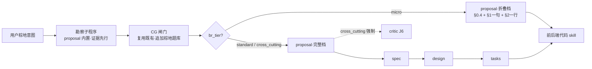

# 棕地项目维护能力 · 修订设计 v2（Proposal-Enrichment 方案）

> 本文是对 [`01-维护skills设计.md`](./01-维护skills设计.md)（下称 v1）的修订设计。
> v1 的**方向正确**（收编进 spec_wf、抽象层分离、补 Seam / 特征测试 / `expire_after`、复用 CG），
> 但一个承重决策——**新建 pre-proposal 阶段 + 新文档类型 `cip.md`**——经源码核验后站不住脚，
> 并级联出五个二级问题。本稿以「**棕地能力是 proposal 的模式增强，而非 proposal 之前的独立阶段**」为核心，
> 重新给出一套与 spec_wf 现有锚点、校验网、CG 协议完全协调的方案。
>
> 文档版本：v2.0 ｜ 定位：替代 v1 的落地方案 ｜ 状态：待评审

---

## 一、为什么推翻 v1 的「新文档 + 新阶段」（源码级证据）

v1 的所有二级问题，都源自一个被忽视的事实：**spec_wf 的治理网是「以 `proposal.md` 为锚点」构建的**。

核验自 [`scripts/validate.mjs`](../../spec_wf/scripts/validate.mjs)：

```js
// inferDocType: 只认 proposal/design/tasks/specs，其它一律 hard fail「无法识别文档类型」
function inferDocType(filePath) {
  if (base === "proposal.md") return "proposal";
  if (base === "design.md")   return "design";
  if (base === "tasks.md")    return "tasks";
  if (/^[a-z0-9-]+\.md$/.test(base) && filePath.includes("/specs/")) return "spec";
  return null;                       // ← cip.md 落这里
}

// isChangeDir: 用 proposal.md 是否存在，作为「这是不是一个 change 目录」的唯一判据
function isChangeDir(dir) {
  return statSync(join(dir, "proposal.md")).isFile();
}
```

由此得到两条 v1 没有正视的硬结论：

| # | 结论 | 后果 |
|---|------|------|
| **A** | `cip.md` 对现有 validator **完全不可见** | v1 §4.10 的「加 I-H1~I-H6」实为「同时改 `inferDocType` + `walkChangeDir` + `isChangeDir` + 新增 `$defs/cip` + 主 dispatch」，集成面被严重低估 |
| **B** | T1（`feeds_into: dev_direct`）目录里**只有 cip.md、没有 proposal.md** → `isChangeDir` 判定「非 change 目录」→ validator 根本不进入 | **I-H 硬门对 T1 永不触发**。偏偏 T1（直接改代码、绕过全部下游）才最需要兜底。v1 把硬门挂在了结构上看不见 T1 的地方 |

外加三个被 v1 论证盖过去的问题：

3. **行数 Tier 违反棕地风险本质**。v1 用 `≤10 / ≤100 / >100 行` 作主轴，但 Feathers《Legacy Code》核心论点是「风险来自接缝与爆炸半径」。反例自在 v1 内部：5 行鉴权改动是高风险、200 行纯新增文件是低风险。
4. **双 CG**。proposal [`SKILL.md:28`](../../spec_wf/proposal-writer-skill/SKILL.md) 已强制 CG + C7 hard fail；v1 在 survey 再设一道 CG，T2/T3 用户走两遍闸门。v1 的 DRY 论证只覆盖了「§0 盘点」，漏了「CG 本身」。
5. **CG 题表方向反了**。v1 的 Q1「你这次的侵入阶梯是?」是在 AI 勘察**之前**把分析负担甩回用户，违背「证据驱动」初衷。

---

## 二、核心范式：frontmatter 承载「具体」，正文承载「战略」

v1 与 design 都卡在同一个两难：「修改方案必含具体方法/文件，但 proposal/design 正文红线都禁止实现细节，所以只能新开一个文档」。

**这个两难是伪两难。** 核验 proposal 现状即可破解：

- proposal §0.2 表格里**已经在写具体路径**（`services/order-api`）；
- frontmatter `impacted_modules: [services/order-api]` **已经是机器可读的具体引用**；
- 而 §1 Problem / §2 Proposed Changes 保持战略叙事。

> **结论：proposal 的「无实现细节」红线（不变量 1）约束的是 §1/§2 的战略叙事，不是 §0 的资产盘点。§0 本就是「具体资产清单」，且不变量 7 明确「§0 不计入 ≤2 页」。**

这把 v1 苦苦寻找的「具体方法该往哪放」一举解决：

| 信息种类 | 承载位置 | 依据 |
|---------|---------|------|
| 战略叙事（为什么改、改什么价值） | proposal §1/§2 正文 | 不变量 1 红线域 |
| **结构化的具体棕地引用**（侵入阶梯 / 改动方法 / 接缝 / 回滚开关） | proposal **frontmatter + §0.4 新表** | §0 本就是具体资产域，红线豁免 |
| 逐方法的实现级清单（代码注释、逐行 diff 依据） | **下沉到 tasks / 代码注释** | tasks 本就是文件/方法粒度 |

这是抽象层分离的**正解**：不是「在 proposal 之前再造一层」，而是「轻结构化引用进 proposal frontmatter，重实现清单下沉 tasks」。

---

## 三、修订后的总体架构

### 3.1 一句话定位

> **棕地维护 = proposal 的 brownfield 模式增强 + 一档 micro 快路径 + 一段「证据先行」的勘察子程序。不新建阶段、不新建文档类型、不新建 CG 闸门。**

`change_mode ∈ {bugfix, extend, refactor}`（即非 greenfield）时，自动激活 brownfield 增强档。

### 3.2 工作流位置（复用既有链，仅在入口分档）



关键差异：**micro 路径仍产出 `proposal.md`**（折叠档），validator 的锚点 `isChangeDir` 看得见它 → micro 不再逃逸治理网（修复 v1 结论 B）。

---

## 四、按「爆炸半径」分档（替换行数 Tier）

引入 `br_tier`（blast-radius tier），**主轴是侵入面与责任面，行数仅作次要参考**：

| `br_tier` | 触发条件（满足全部） | 升档条件（任一即升） | 产物厚度 | 下游 |
|-----------|---------------------|---------------------|---------|------|
| **`micro`** | `invasion_tier ∈ {new_file, composition}`；`modified_existing_methods == []`；单团队；无 `替换/废弃` | 触及既有方法 / 跨团队 / 破坏性 | proposal **折叠档**（§0.4 + §1一句 + §2一行，跳过 spec/design/tasks） | 直接喂代码 skill |
| **`standard`** | 单团队；`modified_existing_methods` 受接缝约束；无跨团队破坏 | 跨团队 / `替换` / `废弃` / `[BREAKING]` | proposal **完整档** → 全链 | 全链路 |
| **`cross_cutting`** | 跨团队 ∨ 含 `替换/废弃` ∨ 含 `[BREAKING]` | — | 完整档 + **强制 critic** + 团队对齐留痕 | 全链路 + critic J6 |

> `br_tier` 由勘察子程序产出候选、CG 确认后写入 frontmatter，作为唯一路由依据。
> **micro 的安全护栏（硬门 I-G6）**：micro **不得触碰既有方法**——这把「5 行鉴权改动」自动挡在 micro 之外（它必含 `modify_existing` → 强制升 standard/cross_cutting），从根上消除 v1 的 LOC 误判。

---

## 五、勘察子程序：证据先行（AI 提议 → 人确认）

这是对 v1「先问用户侵入阶梯」的方向纠正。勘察是 proposal 动笔前的**内置子程序**（不是独立 skill），落在 [`proposal-writer-skill/references/`](../../spec_wf/proposal-writer-skill/) 新增的 `brownfield-survey.md`，四步法：

1. **接缝勘察（Seam Scan）**：定位改动点周边的接缝（构造器注入 / 工厂替换 / 接口扩展 / 子类覆写），产出 `seams` 候选。依据 Feathers《Working Effectively with Legacy Code》。
2. **侵入面评估（Invasion Assessment）**：在接缝基础上，从「新建文件 → 组合 → 继承 → 装饰器 → 改既有方法」五级阶梯中，**由 AI 给出推荐侵入阶梯 + 理由**，产出 `invasion_tier` 候选。
3. **冲突勘察（Conflict Scan）**：检索既有功能语义冲突、在途 PR、CODEOWNERS 责任边界，写入 §0.3 + §2「关联既有资产」列。
4. **回滚勘察（Backout Scan）**：为非纯新增改动设计回滚开关，产出 `rollback_switches` 候选（强制带 `expire_after`）。

> **关键顺序**：勘察 → AI 产出**带证据的候选结论** → CG 让用户**确认或推翻**。
> 用户面对的是「AI 建议用装饰器（理由 X），是否同意？」，而非 v1 的「你打算用第几级侵入？」。
> 这是优秀 harness 的通用范式——**AI proposes, human disposes**——把分析负担留在 AI 侧，把裁决权留在人侧。

---

## 六、CG 单道 + 棕地题库扩展

**不新建 CG 闸门。** 复用 [`clarification-gate-protocol.md`](../../spec_wf/shared/protocols/clarification-gate-protocol.md)（spec_wf 单源 CG 协议），由 C7 硬门兜底留痕。

当 `change_mode != greenfield` 时，proposal 的 CG 题库**追加** 4 道棕地确认题（每题封闭式 + 必含「AI 默认推断」兜底）：

| # | 问题（AI 已先给候选） | 确认对象 |
|---|----------------------|---------|
| BQ1 | AI 建议侵入阶梯为 `{candidate}`（理由：…），是否采纳？ | `invasion_tier` |
| BQ2 | AI 识别到与 `{existing}` 存在 `{替换/共存}` 关系，是否确认？ | `conflicts`（落 §0.3/§2） |
| BQ3 | 改动触及 `{method}`（owner: `{team}`，ticket: `{id}`），是否授权修改？ | `modified_existing_methods` 的人工授权 |
| BQ4 | AI 建议回滚开关 `{key}`（`expire_after: {date}`），是否采纳？ | `rollback_switches` |

- 全部以「AI 候选 + 用户裁决」形态出现，落入既有 `<!-- clarification-gate -->` 块（stage 仍为 `proposal`，复用 C7，无需新 stage）。
- `modified_existing_methods` 非空 **必须**有 BQ3 的 PASS 授权——这取代 v1 的 `confirmation_state` 字段（用既有 CG verdict 表达，少一个字段）。

---

## 七、frontmatter 字段增量（6 个，对齐既有 schema）

向 [`frontmatter-schema.md`](../../spec_wf/shared/contracts/frontmatter-schema.md) 新增 **6 个 proposal 作用域字段**（v1 是 10 个；通过复用 §0.2/§0.3、用 CG 表达确认状态、删除 `feeds_into`/`touched_assets`/`conflicts` 砍掉 4 个）：

| 字段 | 取值 | 必填条件 | 语义 |
|------|------|---------|------|
| `br_tier` | `micro` \| `standard` \| `cross_cutting` | `change_mode != greenfield` | 爆炸半径分档，路由依据 |
| `invasion_tier` | `new_file` \| `composition` \| `inheritance` \| `decorator` \| `modify_existing` | `change_mode != greenfield` | 5 级侵入阶梯 |
| `seams` | `[{kind, at}]` 或 `[]` | 键必存 | 接缝点清单（kind ∈ 构造器注入/工厂替换/接口扩展/子类覆写） |
| `characterization_tests` | `[{target, behavior}]` 或 `[]` | `modified_existing_methods` 非空时必非空 | **特征测试登记**（仅登记需求，代码由下游写） |
| `rollback_switches` | `[{key, default, owner, expire_after}]` 或 `[]` | 键必存；元素的 `expire_after` 必填 | 回滚开关（防永久 flag 债务，Fowler 2017） |
| `modified_existing_methods` | `[{path, method, reason, owner_team, ticket}]` 或 `[]` | `invasion_tier == modify_existing` 时必非空 | 受确认门约束的「可改既有方法」白名单 |

设计约束（与 schema §4/§5 风格一致）：
- 字段一律 snake_case；枚举值一律小写英文；空值统一 `[]`。
- 三个动词类语义（侵入阶梯、接缝种类、关系）须先扩 [`change-verbs.md`](../../spec_wf/shared/contracts/change-verbs.md) 再同步本节——遵循 schema §4.3「新增词条先扩 change-verbs」铁律。
- `greenfield` 时 6 字段全部允许 `[]`/省略值但**键必存**（证明已主动思考），与 schema §5 既有降级规则同构。

---

## 八、proposal 模板增量：新增 §0.4「棕地改动面」

在 [`proposal.md`](../../spec_wf/proposal-writer-skill/templates/proposal.md) 的 §0 既有资产盘点下，新增第四张表 §0.4（仅 `change_mode != greenfield` 时出现；§0 红线豁免、不计入 2 页）：

```markdown
### 0.4 棕地改动面（change_mode != greenfield 时必填）

> 侵入阶梯由勘察子程序产出、CG 确认。写法见 references/brownfield-survey.md。

**侵入阶梯**：`{invasion_tier}`（勘察理由：…）

| 受改既有方法 | 路径 | owner_team | ticket | 接缝策略 | 特征测试 |
|-------------|------|-----------|--------|---------|---------|
| `{method}`  | `{path}` | `{team}` | `{id}` | `{seam.kind}` | `{characterization_test.target}` |

**回滚开关**：`{key}`（default: `{v}`，owner: `{team}`，expire_after: `{date}`）
```

§2 无需新增——它**已有** Blast Radius 列、关联既有资产列、`[BREAKING]` 标记、`change_mode != greenfield` 必填的 Backout 段，直接复用。

### micro 折叠档（修复 v1 的 ceremony tax，同时不逃逸治理网）

沿用 proposal 不变量 4 的 greenfield 折叠机制，扩展出 brownfield-micro 折叠：

```markdown
> §0 棕地-micro 折叠：仅保留 §0.4 改动面表；§0.1/§0.2/§0.3 折叠为一行
> §1 一句话痛点；§2 单行变更；spec/design/tasks 整体跳过（br_tier: micro 自路由 dev）
```

micro 档**仍是合法 proposal.md** → validator 看得见 → I-G 硬门照常生效。这一条同时解决 v1 的「结论 B 逃逸」与「反例 2 仪式过载」。

---

## 九、校验扩展：复用锚点，不动 inferDocType（I-G 系列）

因 cip.md 被取消、一切落在 proposal，**`inferDocType` / `walkChangeDir` / `isChangeDir` 完全不动**。只需：

1. 扩展 [`frontmatter.schema.json`](../../spec_wf/shared/contracts/frontmatter.schema.json) 的 `$defs/proposal`，加 6 个条件必填字段。
2. 在 [`validate.mjs`](../../spec_wf/scripts/validate.mjs) 的跨字段检查段新增 **I-G 系列**（紧接现有 I-A~I-F）：

| 规则 | 内容 | 权威依据 |
|------|------|---------|
| **I-G1** | `change_mode != greenfield` → `invasion_tier` 必填且 ∈ 枚举 | 侵入面强声明 |
| **I-G2** | `invasion_tier == modify_existing` → `modified_existing_methods` 非空，且每项含 `owner_team` + `ticket` | CODEOWNERS 责任路由机器可验证 |
| **I-G3** | `modified_existing_methods` 非空 → `characterization_tests` 非空 | Feathers：改既有行为前先 pin 住 |
| **I-G4** | `invasion_tier == new_file` → `modified_existing_methods == []` | 阶梯自洽性 |
| **I-G5** | `rollback_switches[*].expire_after` 不得为空 | Fowler 2017：防永久 flag 债务 |
| **I-G6** | `br_tier == micro` → `invasion_tier ∈ {new_file, composition}` ∧ `modified_existing_methods == []` ∧ 无跨团队 | micro 安全护栏（替代 LOC 判据） |

CG 留痕**复用 C7**（proposal 早已强制），无需新增 C 规则——这是 v1「沿用 C7 钩子」想要却因 cip.md 不可见而做不到的，现在自然成立。

---

## 十、critic 软门扩展：新增 J6「侵入诚实性」

向 [`spec-critic-skill`](../../spec_wf/spec-critic-skill) 的 J1~J5 之后新增 J6（语义落 [`critic-protocol.md`](../../spec_wf/spec-critic-skill/references/critic-protocol.md) §3，其它文件只引编号——遵循 critic redlines「不复述判据语义」）：

| 判据 | 名称 | 检查点 |
|------|------|--------|
| **J6** | 侵入诚实性 | ① `invasion_tier` 声明与实际改动一致（声明 `composition` 实际改既有方法 → `escalated`）；② `modified_existing_methods` 每项有 `owner_team`+`ticket`+代码注释 `// [MODIFIED by 团队X @日期 reason ticket]`；③ `characterization_tests` 覆盖每个受改方法至少一条原有行为；④ `conflicts` 非空时 §2 有显式处理方案 |

`br_tier == cross_cutting` 时 critic **强制不可豁免**（workflow 不接受 `/critic skip`）——跨团队改动的诚实性必须过软门。

---

## 十一、与 v1 的差异对照（为何更协调）

| 维度 | v1 方案 | v2 修订 | 协调性收益 |
|------|--------|--------|-----------|
| 文档形态 | 新建 `cip.md` 文档类型 | **无新文档**，落 proposal frontmatter + §0.4 | validator 锚点不破，零 `inferDocType` 改动 |
| 阶段 | 新建 pre-proposal 阶段 | **无新阶段**，proposal 内置勘察子程序 | 工作流图不新增节点 |
| micro 路径 | T1 无 proposal → 逃逸治理网 | micro 仍产 proposal 折叠档 | **修复 v1 结论 B**，硬门覆盖 micro |
| 分档主轴 | LOC（≤10/≤100/>100 行） | **爆炸半径**（invasion + 跨团队 + 破坏性） | 符合 Feathers，消除 LOC 误判 |
| CG | survey + proposal 双 CG | **单 CG** + 棕地题库扩展 | 真 DRY，无双闸门 |
| CG 题向 | 用户先答侵入阶梯 | **AI 提议 → 人确认** | 证据先行，符合 harness 范式 |
| 新增字段 | 10 个 | **6 个** | 复用 §0.2/§0.3 + CG verdict，删 4 字段 |
| 确认状态 | 新增 `confirmation_state` 字段 | 复用 CG verdict 块 | 单源，少一字段 |
| 校验集成面 | 改 4 处脚本 + 新 schema | **扩 1 个 `$defs` + 加 I-G** | 集成面收敛一个量级 |

---

## 十二、原提示词六块约束的回收映射（更新版）

| 原条目 | v2 收编位置 |
|--------|------------|
| 一、修改边界约束 | frontmatter `invasion_tier` + `modified_existing_methods` + I-G2/I-G4 + §0.4 表 |
| 二、扩展策略优先级 | 勘察子程序 step 2 五级阶梯 + `references/brownfield-survey.md` |
| 三、代码产出规范 | micro → proposal 折叠档；standard/cross → 复用既有 proposal→spec→design→tasks 链 |
| 四、注释与可追溯性 | critic J6 ②（owner_team/ticket + 代码注释标记）+ tasks 落地 |
| 五、AI 自检清单 | 复用 CG 协议 + 棕地题库 BQ1~BQ4（AI 提议式） |
| 六、禁止行为清单 | 复用 proposal [`redlines.md`](../../spec_wf/proposal-writer-skill/references/redlines.md) + 新增棕地条目（顺手重构/升级依赖/跨域格式化） |

---

## 十三、与 spec_wf 三轨兜底的关系（更新版）

| 轨道 | 既有机制 | v2 贡献 | 对比 v1 |
|------|---------|---------|--------|
| 硬门（validator） | I-A~I-F / C1~C7 | 追加 **I-G1~I-G6**（锚点内，覆盖 micro） | v1 的 I-H 看不见 micro |
| 软门（critic） | J1~J5 | 追加 **J6 侵入诚实性** | 同 v1，但作用于 proposal 而非孤立 cip |
| 审计钩子 | C1~C7 | **直接复用 C7**（proposal 已强制 CG） | v1 想复用 C7 但 cip 不可见 |
| 失败降级 | F1/F2/F3 | 不引入新降级；cross_cutting critic 失败走 F1/F2 | 同 v1 |

---

## 十四、落地步骤

1. **契约层（先于一切）**
   - [ ] [`change-verbs.md`](../../spec_wf/shared/contracts/change-verbs.md) 扩三类动词（侵入阶梯 5 词 / 接缝种类 4 词 / 已含的关系词复用）
   - [ ] [`frontmatter-schema.md`](../../spec_wf/shared/contracts/frontmatter-schema.md) §1/§2/§4/§5 注册 6 字段 + 条件必填规则
   - [ ] [`frontmatter.schema.json`](../../spec_wf/shared/contracts/frontmatter.schema.json) 扩 `$defs/proposal`
2. **proposal-writer 增强**
   - [ ] [`templates/proposal.md`](../../spec_wf/proposal-writer-skill/templates/proposal.md) 加 §0.4 + micro 折叠档
   - [ ] `references/brownfield-survey.md`（四步勘察法）
   - [ ] `references/invasion-ladder.md`（5 级阶梯 + 反例 1 伪两难处理）
   - [ ] [`SKILL.md`](../../spec_wf/proposal-writer-skill/SKILL.md) 不变量补：非 greenfield 触发勘察子程序 + 棕地题库 + br_tier 路由
3. **校验 + critic**
   - [ ] [`validate.mjs`](../../spec_wf/scripts/validate.mjs) 加 I-G1~I-G6（锚点不动）
   - [ ] [`critic-protocol.md`](../../spec_wf/spec-critic-skill/references/critic-protocol.md) §3 加 J6 + cross_cutting 强制
4. **下游衔接 + 文档**
   - [ ] 代码 skill 衔接约定：读 `modified_existing_methods`/`seams`/`rollback_switches`/`characterization_tests`，先写特征测试再改，注释引 proposal §0.4
   - [ ] [`spec-wf总结.md`](../../spec_wf/spec-wf总结.md) 标注 proposal 的 brownfield 增强档 + micro 自路由
   - [ ] [`USER-GUIDE.md`](../../spec_wf/USER-GUIDE.md) 增补棕地三档示例

---

## 十五、设计哲学与边界声明

### 15.1 通俗类比

棕地修改像「老小区户内装修」，v1 与 v2 的差异在**台账挂在哪**：

- v1 新开一本「棕地台账」（cip.md），但稽查员（validator）只认「主台账有没有立项页（proposal.md）」——结果小修（micro）那本棕地台账稽查员翻不到，最该盯的私拆承重墙反在监管视野外。
- **v2 不开新台账，而在主台账立项页上加一页「棕地专章」（§0.4）**——稽查员顺手就查；换灯泡（micro）也要在立项页留半行，所以照样在册。

### 15.2 专业机制（harness 工程视角）

- **锚点内扩展 > 锚点外新建**：治理网建立在「proposal.md = change 存在性锚点」之上。任何不经锚点的产物自动落网外。v2 把棕地能力实现为「锚点内的模式增强」，天然继承全部既有兜底——这是 harness 工程「single source of truth + fail-safe defaults」的直接应用。
- **frontmatter 是具体引用的合法载体**：「无实现细节」红线约束战略叙事（§1/§2），不约束结构化资产清单（§0 + frontmatter）。proposal 早已用 `impacted_modules` 承载具体路径，v2 只是把这一范式延伸到方法/接缝粒度。
- **AI proposes, human disposes**：勘察先产出带证据的候选，CG 只做裁决。把分析负担留 AI、裁决权留人，是优秀 agent harness 的通用闭环。
- **重清单下沉，轻引用上浮**：逐方法实现细节归 tasks（本就方法粒度），proposal 只留确认门所需的白名单摘要——抽象层分离的正解。

### 15.3 适用边界 / 失效场景

- **不适用**：greenfield（直接走标准 proposal，6 字段取空键）；纯调研无改动；一次性脚本。
- **失效场景**：
  - CODEOWNERS / git blame 不可得 → BQ3 用兜底并在 §0.3 标「治理债务」。
  - 既有代码零测试 → `characterization_tests` 需先覆盖既有行为，自动升 `cross_cutting` 并标「测试债务」。
  - 档位边界模糊 → 取上界（升 standard/cross_cutting），与 schema「不确定取强约束」一致。
- **诚实声明**：v2 **不替代** CODEOWNERS / PR review policy / 组织级治理；只把棕地约束以「可机械校验的 frontmatter + 软硬双门」固化进 spec_wf 既有链路。

---

> 文档版本：v2.0
> 与 v1 关系：方向继承，承重决策（新文档/新阶段/LOC 分档/双 CG）推翻重做
> 下一步：等待评审；通过后按 §十四「契约层先行」进入实现
