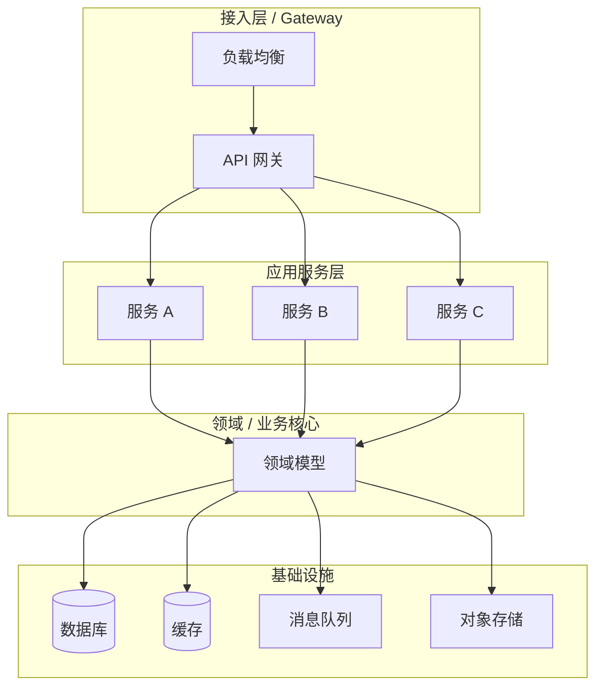
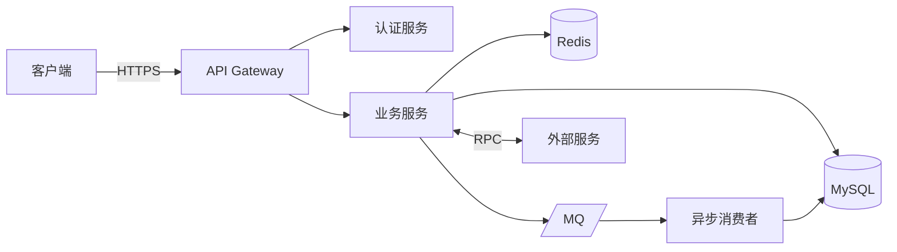
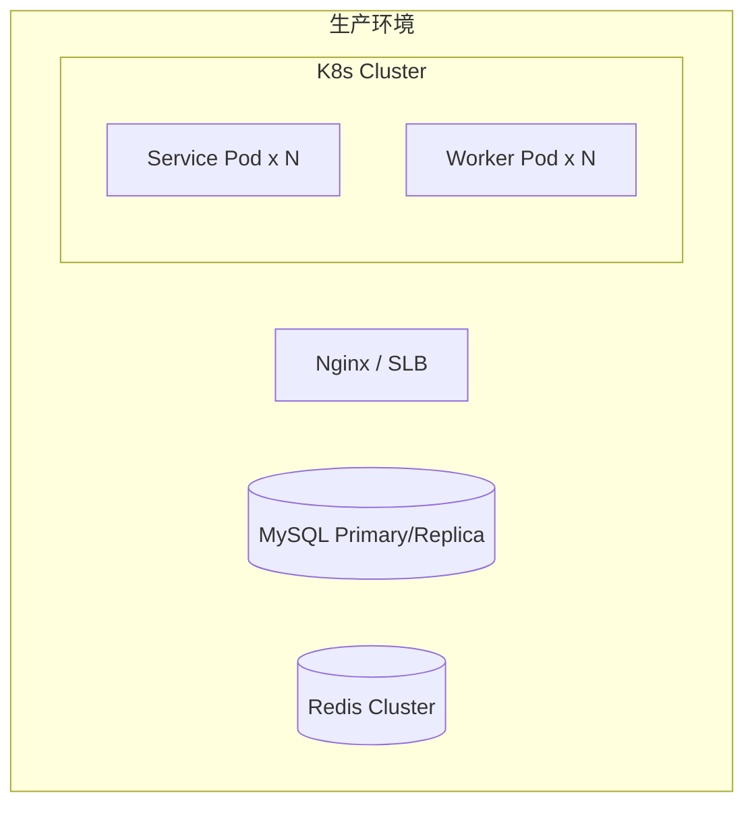

# 系统架构设计 (Architecture Design)

> 本文档由基线初始化 Skill 在 **阶段二 · Step 2.2** 自动生成。
> 标记 `[INFERRED]` 的内容为基于代码逆向推导，未经架构评审确认。

---

## 1. 架构概览 (Architecture Overview)

### 1.1 分层架构图

### 1.2 架构风格

> 描述系统整体采用的架构风格及选型理由。

| 维度       | 选择                | 理由                         |
| ---------- | ------------------- | ---------------------------- |
| 架构风格   | `{style}`           | `{reason}`                   |
| 通信模式   | `{pattern}`         | `{reason}`                   |
| 数据一致性 | `{strategy}`        | `{reason}`                   |

---

## 2. 技术选型 (Technology Stack)

### 2.1 核心技术栈

| 层级       | 技术                | 版本          | 选型理由                     |
| ---------- | ------------------- | ------------- | ---------------------------- |
| **后端**   | `{framework}`       | `{version}`   | `{reason}`                   |
| **前端**   | `{framework}`       | `{version}`   | `{reason}`                   |
| **数据库** | `{db}`              | `{version}`   | `{reason}`                   |
| **缓存**   | `{cache}`           | `{version}`   | `{reason}`                   |
| **消息队列** | `{mq}`            | `{version}`   | `{reason}`                   |
| **搜索引擎** | `{search}`        | `{version}`   | `{reason}`                   |

### 2.2 中间件与基础设施

| 组件                 | 技术                | 用途                         |
| -------------------- | ------------------- | ---------------------------- |
| 配置中心             | `{tech}`            | `{purpose}`                  |
| 服务注册与发现       | `{tech}`            | `{purpose}`                  |
| 链路追踪             | `{tech}`            | `{purpose}`                  |
| 日志采集             | `{tech}`            | `{purpose}`                  |
| 监控告警             | `{tech}`            | `{purpose}`                  |
| CI/CD                | `{tech}`            | `{purpose}`                  |

---

## 3. 系统交互拓扑 (System Topology)

**交互说明**：
1. {客户端与网关交互描述}
2. {服务间调用描述}
3. {异步处理流描述}

---

## 4. 关键设计决策 (Architectural Decision Records)

### ADR-001: {决策标题}

| 项目     | 内容                                     |
| -------- | ---------------------------------------- |
| **状态** | 已采纳 / 提议中 / 已废弃                |
| **背景** | {产生该决策的业务或技术背景}             |
| **决策** | {最终选择的方案}                         |
| **备选** | {方案 A} vs {方案 B}                     |
| **理由** | {选择该方案的核心理由}                   |
| **后果** | {该决策带来的利弊}                       |

---

## 5. 部署架构 (Deployment View)

| 环境   | 配置                    | 说明               |
| ------ | ----------------------- | ------------------ |
| DEV    | `{config}`              | 本地开发           |
| TEST   | `{config}`              | 集成测试           |
| STAGING| `{config}`              | 预发布             |
| PROD   | `{config}`              | 生产环境           |

---

## 6. 横切关注点 (Cross-Cutting Concerns)

### 6.1 安全架构
- 认证：{方案}
- 授权：{方案}
- 数据加密：{方案}

### 6.2 可观测性
- 日志：{方案}
- 指标：{方案}
- 链路追踪：{方案}

### 6.3 容错与弹性
- 熔断降级：{方案}
- 限流：{方案}
- 重试策略：{方案}
