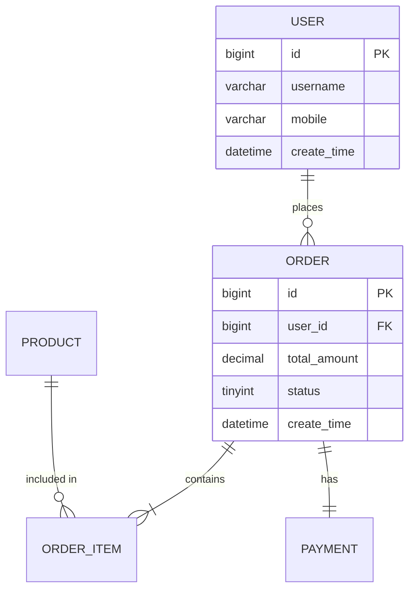

# 数据库详细设计 (Database Implementation Design)

> 本文档由基线初始化 Skill 在 **阶段三 · Step 3.1** 自动生成。
> 结合 `docs/standards/db_rules.md` 中的数据库规范执行。

---

## 1. 设计概述

| 项目         | 内容                                   |
| ------------ | -------------------------------------- |
| **数据库类型** | `{db_type}` (e.g., MySQL 8.0)        |
| **数据库名** | `{db_name}`                            |
| **字符集**   | `utf8mb4 / utf8mb4_unicode_ci`         |
| **表数量**   | `{count}` 张                           |
| **关联规范** | [`db_rules.md`](../standards/db_rules.md) |

---

## 2. ER 关系图 (Entity-Relationship Diagram)



---

## 3. 数据字典 (Data Dictionary)

### 3.1 表：`{table_name}`

**表说明**: {表的业务用途}

| #  | 字段名         | 类型               | 长度 | 必填 | 默认值              | 索引   | 备注                               |
| -- | -------------- | ------------------ | ---- | ---- | ------------------- | ------ | ---------------------------------- |
| 1  | `id`           | BIGINT UNSIGNED    | 20   | ✅   | AUTO_INCREMENT      | PK     | 主键ID                             |
| 2  | `{field}`      | `{type}`           | `{N}`| ✅/❌ | `{default}`        | `{idx}`| `{comment}`                        |
| .. | ...            | ...                | ...  | ...  | ...                 | ...    | ...                                |
| N-4| `create_by`    | VARCHAR            | 64   | ✅   | ''                  | -      | 创建人                             |
| N-3| `update_by`    | VARCHAR            | 64   | ✅   | ''                  | -      | 更新人                             |
| N-2| `create_time`  | DATETIME           | -    | ✅   | CURRENT_TIMESTAMP   | -      | 创建时间                           |
| N-1| `update_time`  | DATETIME           | -    | ✅   | CURRENT_TIMESTAMP   | -      | 更新时间                           |
| N  | `is_deleted`   | TINYINT            | 1    | ✅   | 0                   | -      | 逻辑删除: 0-正常, 1-已删除        |
| N+1| `version`      | INT                | 11   | ✅   | 0                   | -      | 乐观锁版本号                       |

**索引定义**：

| 索引名           | 索引类型 | 字段               | 说明                     |
| ---------------- | -------- | ------------------ | ------------------------ |
| `pk_id`          | PRIMARY  | `id`               | 主键                     |
| `uk_{field}`     | UNIQUE   | `{field}`          | `{说明}`                 |
| `idx_{fields}`   | NORMAL   | `{field1, field2}` | `{说明}`                 |

---

## 4. DDL 语句 (SQL)

### 4.1 `{table_name}`

```sql
CREATE TABLE `{table_name}` (
  `id`          BIGINT(20) UNSIGNED  NOT NULL AUTO_INCREMENT             COMMENT '主键ID',
  -- 业务字段
  `{field}`     {TYPE}({LEN})        NOT NULL DEFAULT {default}          COMMENT '{comment}',
  -- 基线字段
  `create_by`   VARCHAR(64)          NOT NULL DEFAULT ''                 COMMENT '创建人',
  `update_by`   VARCHAR(64)          NOT NULL DEFAULT ''                 COMMENT '更新人',
  `create_time` DATETIME             NOT NULL DEFAULT CURRENT_TIMESTAMP  COMMENT '创建时间',
  `update_time` DATETIME             NOT NULL DEFAULT CURRENT_TIMESTAMP
                ON UPDATE CURRENT_TIMESTAMP                              COMMENT '更新时间',
  `is_deleted`  TINYINT(1)           NOT NULL DEFAULT 0                  COMMENT '逻辑删除: 0-正常, 1-已删除',
  `version`     INT(11)              NOT NULL DEFAULT 0                  COMMENT '乐观锁版本号',
  PRIMARY KEY (`id`),
  UNIQUE KEY `uk_{field}` (`{field}`),
  KEY `idx_{field}` (`{field}`)
) ENGINE=InnoDB DEFAULT CHARSET=utf8mb4 COLLATE=utf8mb4_unicode_ci
  COMMENT='{表用途说明}';
```

---

## 5. 数据量估算 (Data Volume Estimation)

| 表名             | 初始数据量    | 日增量          | 1 年预估       | 归档策略            |
| ---------------- | ------------- | --------------- | -------------- | ------------------- |
| `{table_name}`   | `{init}`      | `{daily}`       | `{yearly}`     | `{strategy}`        |

---

## 6. 数据迁移计划 (Migration Plan)

> 如为存量系统，说明历史数据的迁移策略。

| 迁移项           | 源                | 目标              | 方式            | 预计耗时   |
| ---------------- | ----------------- | ----------------- | --------------- | ---------- |
| `{item}`         | `{source}`        | `{target}`        | `{method}`      | `{time}`   |
