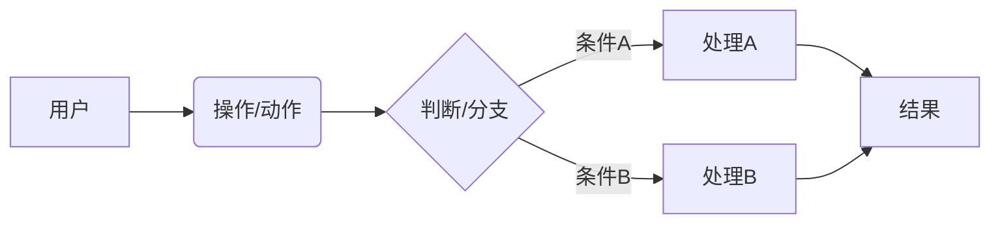

# 需求规格说明书 (Requirements Specification)

> 本文档由基线初始化 Skill 在 **阶段二 · Step 2.1** 自动生成。
> 标记 `[INFERRED]` 的内容为基于代码逆向推导，未经业务方确认。

---

## 1. 业务背景与目标 (Business Context)

### 1.1 项目背景
> 简述项目的产生背景、所处业务领域及试图解决的核心问题。

### 1.2 业务目标
| #  | 目标               | 衡量指标 (KPI)           | 目标值        |
| -- | ------------------ | ------------------------ | ------------- |
| 1  | `{goal_1}`         | `{metric}`               | `{target}`    |
| 2  | `{goal_2}`         | `{metric}`               | `{target}`    |

### 1.3 系统边界 (Scope)
- **包含**: {本系统负责的业务范围}
- **排除**: {明确不在本系统范围内的功能}
- **外部依赖**: {依赖的上下游系统}

---

## 2. 用户角色与权限 (User Roles)

| 角色名       | 描述                 | 核心权限                     |
| ------------ | -------------------- | ---------------------------- |
| `{role_1}`   | `{description}`      | `{permissions}`              |
| `{role_2}`   | `{description}`      | `{permissions}`              |

---

## 3. 核心业务流程 (Core Business Flows)

> 使用 Mermaid 绘制系统的关键业务流程。

### 3.1 主流程: {流程名称}

**流程说明**：
1. {步骤 1 描述}
2. {步骤 2 描述}
3. {步骤 3 描述}

### 3.2 异常/分支流程

> 描述核心流程中可能出现的异常分支及其处理逻辑。

---

## 4. 功能模块清单 (Functional Modules)

| 模块         | 功能点               | 优先级  | 描述 / 验收标准                    | 关联流程    |
| ------------ | -------------------- | ------- | ---------------------------------- | ----------- |
| `{module_1}` | `{feature_1}`        | **P0**  | `{description_and_acceptance}`     | 主流程 3.1  |
| `{module_1}` | `{feature_2}`        | **P1**  | `{description_and_acceptance}`     | -           |
| `{module_2}` | `{feature_3}`        | **P0**  | `{description_and_acceptance}`     | 主流程 3.1  |
| `{module_2}` | `{feature_4}`        | **P2**  | `{description_and_acceptance}`     | -           |

**优先级说明**：
- **P0 (Must Have)**: 核心功能，必须交付
- **P1 (Should Have)**: 重要功能，争取交付
- **P2 (Nice to Have)**: 增强功能，有余力时交付

---

## 5. 非功能性需求 (Non-Functional Requirements)

### 5.1 性能要求 (Performance)

| 指标              | 目标值              | 说明                           |
| ----------------- | ------------------- | ------------------------------ |
| 接口响应时间      | TP99 < `{value}`ms  | 核心读接口                     |
| 系统吞吐量        | QPS > `{value}`     | 峰值场景                       |
| 并发用户数        | `{value}` 在线      | 正常业务时段                   |
| 数据库查询        | < `{value}`ms       | 单表查询在合理索引条件下       |

### 5.2 安全要求 (Security)

- [ ] 数据传输加密 (HTTPS/TLS)
- [ ] 敏感数据存储加密 (AES-256)
- [ ] 接口鉴权 (JWT / OAuth2)
- [ ] 操作审计日志
- [ ] SQL 注入 / XSS 防护
- [ ] 接口限流与防刷

### 5.3 可用性 (Availability)

| 项目         | 目标                     |
| ------------ | ------------------------ |
| SLA          | `{value}` (如 99.9%)     |
| RTO          | `{value}` (恢复时间目标) |
| RPO          | `{value}` (恢复点目标)   |
| 数据备份     | `{strategy}`             |

### 5.4 可观测性 (Observability)

- [ ] 结构化日志 (JSON 格式)
- [ ] 分布式链路追踪 (TraceID 透传)
- [ ] 核心业务指标监控 (Prometheus / Grafana)
- [ ] 异常告警 (告警级别分级)

---

## 6. 约束与假设 (Constraints & Assumptions)

### 约束
- {技术栈限制}
- {合规性要求}
- {时间与资源限制}

### 假设
- {业务假设}
- {技术假设}
