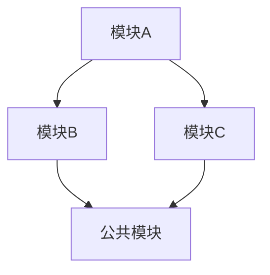

# 系统总纲 (System Master Plan)

> 本文档由基线初始化 Skill 在 **阶段五 · Step 5.1** 自动生成。
> 采用 **渐进式披露** 设计：先概貌，后索引。

---

## A. 系统定位 (Positioning)

> **一句话定义**：本系统是一个 `{系统类型}`，旨在解决 `{核心问题}`，核心价值在于 `{核心价值}`。

| 维度       | 描述                                     |
| ---------- | ---------------------------------------- |
| **目标用户** | {target_users}                          |
| **核心场景** | {core_scenarios}                        |
| **系统边界** | {system_boundary}                       |

---

## B. 核心设计思想 (Core Philosophy)

> 系统的"灵魂"——理解以下思想即可把握系统全貌。

1. **{思想 1}** (e.g., 领域驱动设计 DDD)
   - 采用充血模型，确保业务逻辑内聚于领域层
   - 通过限界上下文划分微服务边界

2. **{思想 2}** (e.g., 读写分离 CQRS)
   - 命令端处理写操作，查询端优化读性能
   - 最终一致性保证

3. **{思想 3}** (e.g., 插件化扩展)
   - 核心流程定义标准 SPI，支持定制实现

### 模块关系结构

---

## C. 关键点设计概述 (Key Design Highlights)

> 不看代码也能掌握的核心技术策略。

### C.1 {技术难点 1} (e.g., 高并发策略)
- **挑战**: {描述}
- **方案**: {对策}
- **效果**: {预期指标}

### C.2 {技术难点 2} (e.g., 数据一致性)
- **挑战**: {描述}
- **方案**: {对策}
- **效果**: {预期指标}

### C.3 {技术难点 3} (e.g., 安全性设计)
- **挑战**: {描述}
- **方案**: {对策}
- **效果**: {预期指标}

---

## D. 测试规范与策略 (Testing Conventions)

> 作为后续 AI 协同开发的 TDD 指引"宪法"，指导代码与测试双向驱动。

### D.1 测试框架与选型
- **基础运行**: {例如 JUnit 5, Mockito 等}
- **集成测试**: {例如 `SpringBootTest`, `MockMvc`, 是否利用测试专用配置 `@ActiveProfiles("test")`}
- **数据层测试**: {例如独立 Mock 还是内嵌/真实 DB，是否利用 TestDataHelper 手动插入数据}

### D.2 编码与命名约定
- **类名**: 以 `Test` 或 `IntegrationTest` 结尾
- **方法名**: `{方法名}_当{条件}_应返回{结果}` 或 BDD 风格的 `should_{DoSomething}_when_{Condition}`
- **断言风格**: {如 `assertEquals`, `assertThrows`}

### D.3 TDD 闭环要求
1. **RED 阶段**: 必须先根据 Spec 中的 `Given/When/Then` 判定编写失败测试。
2. **GREEN 阶段**: 只编写使其恰好通过的业务代码。
3. **隔离性原则**: Unit Tests 不能强依赖 Spring Context 启动机制（除非明示需要 Integration Test），通过隔离的 Mock 提升速度。

---

## E. 渐进式文档索引 (Document Map)

> 格式：标题 + 摘要 + 链接

### 1. 工程与规范
- **[工程现状分析](analysis/agent.md)** — 工程画像、技术栈依赖分析与初始化路径建议。
- **[API 规范](standards/api_rules.md)** — 基于 OpenAPI 的 RESTful 接口协议、响应格式与安全规范。
- **[数据库规范](standards/db_rules.md)** — 命名规范、通用字段定义、索引策略与 DDL 变更流程。
- **[工程通用规范](standards/project_rules.md)** — 目录结构、错误码体系、Git 规范与日志规范。
- **[单元测试与 TDD 规范](standards/testing_rules.md)** — Mock 策略、框架选型与完整的 Red-Green-Refactor 准则。

### 2. 设计与架构
- **[需求规格](design/requirements.md)** — 业务目标、核心流程图 (Mermaid)、功能模块清单与 SLA 指标。
- **[系统架构](design/architecture.md)** — 分层架构图、技术选型理由、系统拓扑与关键设计决策。

### 3. 详细落地
- **[数据库设计](design/database_design.md)** — ER 关系图、数据字典、完整 DDL 与数据量估算。
- **[接口定义](design/api_design.md)** — 各模块接口的完整定义、入参出参与示例。
