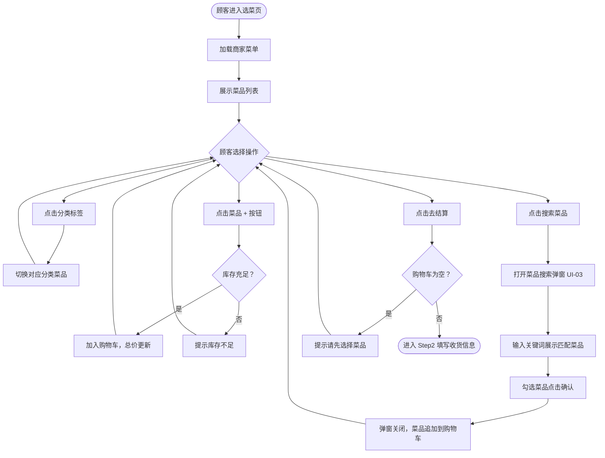

# 运行时业务人机协同梳理 — 通用设计思路

> **文档定位**：定义基于运行时采集（runtime-capture）+ 代码地图（runtime-flow-mapper）产物，由人机协同完成业务功能与流程梳理的通用方法论。
> **适用范围**：棕地项目接管、遗留系统治理、业务文档补全等场景。
> **前置产物**：
> - `runtime-capture` skill 输出的操作记录 / 导航序列 / API 时序
> - `runtime-flow-mapper` skill 输出的运行时业务流程精准地图（AI 初步版）
>
> **贯穿全文的统一示例**：某外卖点餐平台的「下单」业务，涉及：商家列表 → 下单填写（选菜品 + 填收货信息 + 确认支付）→ 订单列表 → 菜品搜索弹窗。全文所有示例均基于此场景，保持上下文一致，降低理解成本。

---

## 整体协同思路

### 为什么需要人机协同？

AI 主导的 `runtime-flow-mapper` 输出是**精准但有局限**的初步版本：
- **精准**：基于真实运行时录制 + 代码三证对齐，具备较高可信度
- **局限**：单次录制只覆盖「操作者当时走过的路径」，存在以下盲区：
  - 分支路径（如取消订单、申请退款）未录制到
  - 权限隔离界面（如商家后台、管理员配置页）录制者无法访问
  - 后台处理流程（如系统自动推送骑手）无界面呈现

人机协同的核心价值：**由人补充 AI 无法自动感知的业务语义、界面边界与业务规则**。

### 协同节奏

```text
Step 1 [AI 主导]  runtime-capture：录制操作记录 + API 时序
        ↓
Step 2 [AI 主导]  runtime-flow-mapper：生成初步流程地图（AI 版）
        ↓
Step 3 [人工介入] 业务界面梳理：确认界面边界与合并/拆分策略
        ↓
Step 4 [人机协同] 界面业务深挖：逐界面补充业务描述 + 功能地图
        ↓
Step 5 [人工校验] 流程对齐：与业务方确认流程完整性，补充录制盲区
        ↓
Step 6 [AI 输出]  生成最终版业务功能与流程地图文档
```

---

## 一、总体业务流程简介

### 撰写目标

面向**快速接管**场景，用 300 字以内让新接手成员理解：
- 这个模块/系统解决什么业务问题
- 主要参与角色有哪些
- 核心流程的起点和终点

### 撰写来源

| 信息来源 | 对应产物 |
|---------|---------|
| runtime-capture 的导航序列 | 提炼业务流程主干路径 |
| runtime-flow-mapper 的 L0 上下文节 | 角色、外部系统、业务目标 |
| flow-map 的状态流转 | 核心状态节点（起点→终点） |
| 人补充 | 业务背景、行业语义、录制未覆盖的分支说明 |

### 写作规范

- 禁止技术语言（不写接口名、类名、数据字段）
- 以业务角色为主语（如「顾客」「商家」「骑手」「平台客服」）
- 包含：**背景一句话 + 角色列举 + 流程主线 + 关键约束**

**示例**：

> 本模块是外卖平台的核心下单流程，覆盖从顾客选择商家、挑选菜品、填写收货信息到完成支付的完整链路。主要参与角色包括：顾客（发起下单）、商家（接单与备餐）、骑手（配送）、平台（撮合与监控）。流程起点为顾客打开商家页面，终点为订单进入「待配送」状态。关键约束：支付超时未完成则订单自动取消；商家超时未接单则系统自动提醒。

---

## 二、业务界面梳理

界面梳理是后续所有业务分析的**定锚点**，必须先于界面业务描述完成。核心任务：**明确本次涉及哪些界面，以及界面之间的组合/嵌套关系**。

### 2.1 界面识别来源

| 来源 | 具体方式 |
|------|---------|
| runtime-capture 导航序列 | 每次页面地址变化 = 一个独立界面候选 |
| runtime-flow-mapper 节点清单 | 每个「页面跳转」类节点 = 界面边界 |
| 前端工程文件扫描 | `src/views/` 目录下的页面文件 |
| 人工核查 | 比对录制截图与工程文件，补充未录制到的界面 |

### 2.2 界面分类策略

#### 类型 A：合并界面

**定义**：多个视觉步骤组成同一张业务单据的填写过程，合并为一个「业务界面」来描述。

**识别特征**：步骤条存在（第1步/第2步/第N步），页面地址不变仅内容区切换；各步骤共享同一条业务记录 ID；上一步保存后下一步依赖同一条数据继续填写。

**示例**：
```text
外卖下单填写（合并界面，3步骤）
  ├── Step1 选择菜品
  ├── Step2 填写收货信息
  └── Step3 确认支付
```

#### 类型 B：子界面（弹窗/抽屉/侧滑）

**定义**：从主界面触发、完成单一子任务后关闭并将结果回传给主界面的弹窗或抽屉。

**识别特征**：录制 API 时序中出现特定查询接口但页面地址未变化；前端存在弹窗/抽屉组件；关闭时有明确返回值传回主界面。

**处理方式**：归属到触发它的主界面下，不单独列为顶层界面。标注：触发条件 / 子任务目标 / 回传内容。

**示例**：
```text
外卖下单填写 > Step1 选择菜品
  └── [子界面] 菜品搜索弹窗
        触发：点击「搜索菜品」按钮
        子任务：按关键词搜索，勾选想要的菜品
        回传：已勾选的菜品列表，追加回主界面的购物车
```

#### 类型 C：独立功能界面

**定义**：有独立页面地址、独立业务目的的单体界面（如列表页、详情页）。

**识别特征**：页面地址变化时进入，有独立页面标题和操作区，不依附于其他单据填写流程。

**示例**：`商家列表页`（展示附近商家，点击进入下单）、`订单列表页`（查看历史订单）

#### 类型 D：多视角同源界面

**定义**：不同角色通过不同入口访问同一业务单据，结构相同但可操作内容因角色而异。

**识别特征**：复用相同页面组件，通过路由参数（如 `role` / `viewMode`）区分角色权限。

**处理方式**：主体描述合并，差异（哪个角色多哪些按钮、哪些区域只读）单独标注。

**示例**：
```text
订单详情页（多视角同源）
  - 顾客视角：查看状态、申请退款
  - 商家视角：查看状态、确认接单、修改备注
  （同一页面组件，role 参数控制按钮显示）
```

### 2.3 界面清单格式

```markdown
| 界面ID | 界面名称            | 类型          | 页面地址/组件     | 触发入口            | 所属流程节点 |
|--------|-------------------|---------------|-----------------|--------------------| ------------|
| UI-01  | 商家列表页          | 独立界面       | /home           | 首页导航            | 节点1        |
| UI-02  | 外卖下单填写（3步）  | 合并界面       | /order/create   | UI-01 点击商家卡片  | 节点2-4      |
| UI-02a | Step1 选择菜品      | 合并子步骤     | — (组件切换)     | 进入 UI-02          | 节点2        |
| UI-02b | Step2 填写收货信息  | 合并子步骤     | — (组件切换)     | Step1 点击下一步    | 节点3        |
| UI-02c | Step3 确认支付      | 合并子步骤     | — (组件切换)     | Step2 点击下一步    | 节点4        |
| UI-03  | 菜品搜索弹窗         | 子界面（弹窗） | — (Modal)       | UI-02a 点击搜索按钮 | 节点2        |
| UI-04  | 订单列表页          | 独立界面       | /orders         | 底部导航「我的订单」 | 节点5        |
| UI-05  | 订单详情页          | 多视角同源     | /order/:id      | UI-04 点击订单行    | 节点6        |
```

---

## 三、业务界面业务梳理

### 3.1 界面业务描述

每个界面（或合并界面的每个 Step）需要独立梳理以下三项内容。

#### (1) 界面业务介绍

用业务语言描述：**这是什么界面、谁在用、能做什么、关键约束是什么**。

写作规范：禁止使用接口名、组件名、字段名作为主体，以用户行为描述。

**示例**：

> **UI-02a · Step1 选择菜品**
> 顾客在商家菜单中选择想要点的菜品，加入购物车，确认品类和数量无误后进入下一步。
> 使用角色：顾客。
> 能做什么：浏览菜品分类、搜索菜品、调整菜品数量、查看购物车汇总、进入下一步。
> 关键约束：购物车为空时「下一步」按钮不可点击；库存为零的�品不可添加。

#### (2) 界面截图

预留位置，后续录制截图补充。

#### (3) 上下文说明

| 维度 | 内容 |
|------|------|
| **前置依赖** | 进入该界面前，必须完成什么操作 / 必须存在什么数据 |
| **后置关联** | 在该界面完成操作后，会影响哪些下游界面或流程节点 |
| **数据依赖** | 该界面依赖哪些外部系统或其他模块提供的数据 |
| **权限依赖** | 哪些角色可以访问 / 哪些操作需要特定权限 |
| **状态依赖** | 业务数据处于什么状态时，该界面的操作才可用 |

**示例**：

> **UI-02a · Step1 选择菜品 — 上下文说明**
>
> - 前置依赖：已选择具体商家（商家 ID 通过路由参数传入）；商家当前处于营业中状态
> - 后置关联：购物车菜品列表传递给 Step2（收货信息）和 Step3（支付确认）；菜品总金额影响 Step3 的优惠券是否可用
> - 数据依赖：菜品列表依赖商品服务（含价格、库存、分类）；活动标签依赖营销服务
> - 权限依赖：仅已登录顾客可操作；未登录可浏览但点「加入购物车」时跳转登录
> - 状态依赖：商家休息中时菜品可浏览但无法加入购物车

---

### 3.2 界面功能地图

#### 核心原则：区分功能类型

功能地图必须区分两种功能类型，写法完全不同：

| 功能类型 | 说明 | 写法要求 |
|---------|------|---------|
| **完整闭环型** | 操作在当前界面内完成，无需跳转子界面 | 直接写：触发方式 → 操作结果 → 关联 API |
| **入口型（带子任务）** | 当前界面只是触发入口，核心操作在子界面完成，子界面结果回传后主界面继续处理 | 拆解为三段：① 入口触发 → ② 子界面任务 → ③ 回传处理 |

> **为什么要区分？** 若把「入口型」写成「完整闭环型」，读者会误以为操作在当前界面直接完成，看不到子界面跳转和数据回传的全过程，导致业务流程描述不准确。

#### 功能地图骨架（树形总览）

先用树形结构给出当前界面所有功能点的全貌，标注每个功能组的类型：

```text
UI-02a Step1 选择菜品
  ├── 【菜品浏览与购物车管理】（完整闭环型）
  │     ├── 按分类筛选菜品
  │     ├── 调整购物车中菜品数量（+ / -）
  │     └── 查看购物车汇总金额
  ├── 【搜索并添加菜品】（入口型，子界面 UI-03）
  │     ├── 入口：点击搜索框 → 打开菜品搜索弹窗
  │     ├── 子界面任务：输入关键词 → 展示匹配菜品 → 勾选
  │     └── 回传处理：所选菜品批量追加到购物车
  └── 【进入下一步】（完整闭环型）
        ├── 前置检查：购物车不为空
        └── 操作结果：保存购物车快照，切换到 Step2
```

#### 功能点详细描述

骨架之后，对每个功能组展开详细描述。

**完整闭环型**写法模板：

```text
功能名：[功能名称]
类型：完整闭环型
触发方式：[用户如何触发]
操作结果：[触发后界面/数据发生了什么变化]
关联 API：[HTTP方法 /路径]  [确信度]
关键约束：[有哪些前置条件或限制]
```

**示例（完整闭环型）**：

```text
功能名：调整购物车菜品数量
类型：完整闭环型
触发方式：点击菜品旁的 + 或 - 按钮
操作结果：
  - 点击 +：数量 +1，底部总价实时更新
  - 点击 -：数量 -1，减到 0 时该菜品自动从购物车移除
关联 API：PUT /cart/item  [runtime+码]
关键约束：数量不可超过该菜品当前库存
```

**入口型（带子任务）**写法模板：

```text
功能名：[功能名称]
类型：入口型（带子界面 [子界面ID]）

① 入口触发
  触发方式：[用户如何触发]
  触发结果：打开 [子界面名称]

② 子界面任务（[子界面ID] 内完成）
  - [操作步骤1]（关联 API：[HTTP方法 /路径]）
  - [操作步骤2]（本地状态，无 API）
  - [操作步骤3]（如：点击「确认」，弹窗关闭）
  可选操作：[其他可选操作]

③ 回传处理（弹窗关闭后，主界面执行）
  回传内容：[子界面返回了什么数据]
  主界面处理：[主界面拿到数据后做了什么]
  关联 API：[HTTP方法 /路径]  [确信度]
  关键约束：[有哪些约束]
```

**示例（入口型）**：

```text
功能名：搜索并添加菜品
类型：入口型（带子界面 UI-03）

① 入口触发
  触发方式：点击界面顶部「搜索菜品」图标
  触发结果：打开菜品搜索弹窗（UI-03）

② 子界面任务（UI-03 菜品搜索弹窗内完成）
  - 输入关键词，实时展示匹配菜品列表（GET /menu/search?keyword=）
  - 勾选一个或多个目标菜品（本地状态，无 API）
  - 点击「确认添加」，弹窗关闭
  可选操作：清空搜索词、切换排序方式

③ 回传处理（弹窗关闭后，主界面执行）
  回传内容：已勾选的菜品列表（含品项 ID + 数量）
  主界面处理：将回传菜品批量追加到购物车，刷新购物车汇总金额
  关联 API：PUT /cart/items  [码]
  关键约束：若菜品已在购物车中，数量叠加而非重复创建行
```

---

### 3.3 界面流程图

**适用场景**：界面内部存在条件分支或子界面交互时补充；纯列表增删改查无需流程图。

**示例（UI-02a Step1 选择菜品）**：



**流程图规范**：
- 节点使用业务语言，不写接口名
- 分支条件写业务判断（「库存充足？」），不写技术字段
- 子界面交互用「打开弹窗」→「操作完成」→「弹窗关闭，结果回传」三节点表示

---

## 四、录制盲区补充策略

AI 主导的初步版本存在录制盲区，人机协同时需主动识别并补充。

### 4.1 常见录制盲区

| 盲区类型 | 识别方法 | 补充策略 |
|---------|---------|---------|
| 分支路径（取消/退款/拒绝） | flow-map 状态流转图缺少某些迁移弧 | 人工操作触发分支，或从代码 cancel/reject 方法推断 |
| 权限隔离界面 | 录制者角色无法访问的菜单或按钮 | 切换角色账号补录，或从前端权限代码推断 |
| 后台异步处理 | API 时序中出现轮询接口 | 找到后端异步逻辑，补充为「系统后台处理节点」 |
| 子界面（弹窗/抽屉） | API 时序中出现查询但页面地址未变化 | 展开弹窗组件代码，补充入口型功能描述 |
| 管理员配置界面 | 业务流程依赖但录制未访问的配置 | 从业务规则反推，找对应配置管理界面 |

### 4.2 补充信息格式

在文档对应位置插入如下格式的盲区说明：

```text
⚠️ 录制盲区补充（人工）
- 盲区类型：分支路径
- 场景描述：顾客在支付成功后 5 分钟内申请取消订单
- 触发条件：订单处于「待接单」状态，顾客点击「取消订单」
- 关联接口：POST /order/cancel
- 状态变更：待接单 → 已取消，触发退款流程
- 确信度：[码]（OrderService.cancelOrder() 代码确认）
```

---

## 五、最终文档输出规范

### 5.1 文档结构模板

```text
# {业务模块名称} 运行时业务功能与流程地图

## 一、总体业务流程简介（300字以内）

## 二、业务界面清单
  2.1 界面清单总表
  2.2 界面关系图（Mermaid）

## 三、界面业务详细梳理
  ### UI-01 {界面名称}
    业务介绍
    上下文说明
    功能地图
      - 骨架（树形总览）
      - 完整闭环型功能详细描述
      - 入口型功能详细描述（含子任务三段式）
    界面流程图（如适用）
  ### UI-02 ...（按界面逐一展开）

## 四、录制盲区补充清单

## 五、跨界面业务规则汇总

## 附录：接口-界面映射表
```

### 5.2 确信度标注规范

| 标注 | 含义 |
|------|------|
| `[runtime+码]` | 运行时录制 + 代码双重验证（最高） |
| `[码]` | 代码直接验证 |
| `[人工]` | 人工操作验证或业务方确认 |
| `~推断` | 基于相关代码推断，未直接验证 |
| `~待确认` | 存疑，需业务方或进一步录制确认 |

### 5.3 迭代更新节奏

| 触发事件 | 需更新的文档部分 |
|---------|---------------|
| 新一轮 runtime-capture 录制 | 更新界面清单 + 对应界面的功能地图 |
| 业务方反馈流程有误 | 更新对应界面的业务介绍 + 流程图 |
| 代码变更（新增/删除接口） | 更新功能地图中的关联 API |
| 发现新录制盲区 | 补充第四节录制盲区清单 |