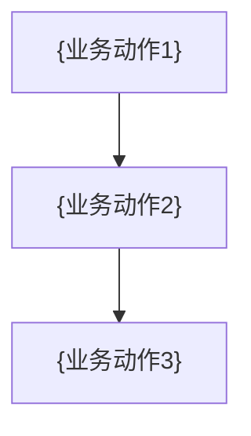

> 现状业务流程说明 · 描述系统当前实际运转 · 非规范

# {业务流程名} — 业务流程说明

## 一、业务概述

{谁在什么场景下做什么、达成什么业务目标——2-4 句}

**业务术语**
- {术语}：{业务含义}
- …

**依赖的外部业务能力**
- {外部能力，如"风控评估""附件存储"}：{在本流程中的作用}

## 二、业务流程（端到端）

{按「角色 + 环节」时序，叙述从起点到闭环的全过程}


> 节点为业务动作，无接口/无路径；只保留结构。

## 三、各环节业务规则

### 环节1：{业务动作名}（角色：{谁}）
- **前置条件**：{进入本环节需满足什么}
- **业务规则**：
  - {精确规则一句}〔已核实〕
  - {精确规则一句}〔待核实〕
- **产出数据**：{产生/变更了什么业务数据或状态}
- **异常处理**：{失败/拒绝时怎么走}

### 环节2：{业务动作名}（角色：{谁}）
{同上结构}

## 四、业务数据流转

{核心业务实体在各环节的状态变化，业务语言}

```
{实体}状态： {状态A} → {状态B} → {状态C}
                         ↓
                      {分支状态}
```
> 〔待核实〕：基于当前观察，可能还有未触达的状态。

## 五、角色与权限

| 角色 | 能做什么 | 确信度 |
|------|---------|--------|
| {角色A} | {操作清单} | 〔待核实〕 |
| {角色B} | {操作清单} | 〔已核实〕 |
