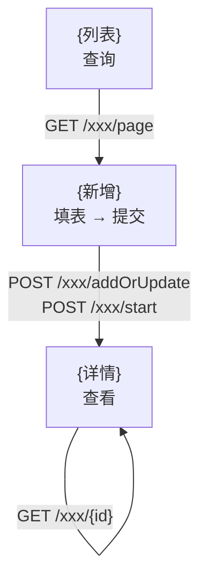

# {业务流程名} — 运行时业务流程精准地图

> 来源：runtime-capture 产物（session_log / records.ts / api_requests / api_details）+ CodeGraph/GitNexus 代码落锚
> 工作目录：`{工作目录}/{name}/` ｜ 生成时间：{ISO}

---

## 一、业务流程简介

{2-3 句：业务场景 + 核心价值}

---

## 二、流程节点清单（按时序）

### 节点 1：{节点名称}
- **节点描述**：{1 句业务含义}
- **关联 API**：
  - `GET /api/xxx/list` — {用途}
  - `POST /classifymanage/api/xxx` — {用途} `[外部:classifymanage] 本地工程无源码，来源：共享组件/微前端`
- **前端关联代码**：
  - 路径：`src/views/.../Index.vue`、`src/api/xxx.js`
  - 调用逻辑：{1-2 句，结合本节点上下文}
- **后端关联代码**：
  - 类：`com.xxx.XxxController.list()` → `XxxService.page()`
  - 接口逻辑：{1-2 句：校验→查询→转换→持久化}
- **上下文关联**：{与上/下节点的数据流转、状态依赖}

### 节点 2：{节点名称}
{同上结构}

---

## 三、界面-API-Handler 三证对齐表

| 界面操作 | HAR API | 前端组件 | 前端 API 函数 | 后端 Handler |
|---------|---------|---------|--------------|-------------|
| {加载列表} | `GET /xxx/page` | `Index.vue` | `pageXxx()` | `XxxController.page()` |
| {新增} | `POST /xxx/addOrUpdate` | `BaseInfo/Index.vue` | `addOrUpdateXxx()` | `XxxController.addOrUpdate()` |
| {删除} | `DELETE /xxx/{id}` | `Index.vue` | `deleteXxx()` | `XxxController.deleteById()` |

> 未确证项标 `~inferred`。

---

## 四、外部系统调用

| 外部系统 | API 路径 | 用途 | 前端调用来源 |
|---------|---------|------|------------|
| {supprisk 供应商风控} | `POST /supprisk/api/...` | {用途} | 未在本工程找到，疑为共享组件/微前端注入 |
| {infrastructure 基础设施} | `GET /infrastructure/api/attachment/...` | {附件查询} | 本工程 `src/api/attachment.js` |

---

## 五、状态流转

```
流程状态(flowStatus): NOT_INITIATED → IN_THE_PROCESS → PASS
                                    ↓
                                 REFUSE / RETURN / CANCELED
```
> 单样本观察，可能不全 —— ~inferred。

---

## 六、流程图


> 流程图**只保留结构**，禁止 `classDef` / `style` / `class` 样式定义。

---

## 附：接口总览

> 详见同目录 `{name}_api_requests.txt`（摘要）/ `{name}_api_details.txt`（明细）
> 共捕获 {N} 条请求 / {M} 条去重接口
