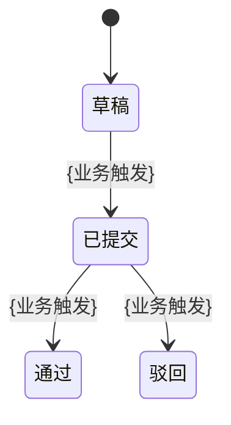

> 现状(as-is)业务规约 · 非规范性 · 仅供参考
> 来源：`docs/runtime-flow/{name}/{name}_flow-map.md` + 前后端代码深探 ｜ 生成时间：{ISO}
> 规约层级：仅 L0–L2（借 spec specs.md 业务语言结构，不含变更/L3/L4 机制）

# {业务流程名} — 现状业务规约

---

## L0 业务上下文

- **业务目标**：{一句话业务价值}
- **关键场景**（1–3 条）：
  - {场景一}
- **依赖业务能力（上下文依赖）**：
  - `[码]` `{依赖能力}` —— 来源：`{节点/服务}`
  - `[外部·本地无源码]` `{外部系统}` —— 用途：{…}
- **关键术语**：
  - "`{术语}`" = {业务定义}

---

## L1 用户故事

> 每个核心节点 → 1–N 条 US；每条带溯源。纯外部"系统准入"节点一句概述即可。

- **US-1** `[码][runtime]`：作为 `{角色}`，我希望 `{目标}`，以便 `{价值}`。
  - 溯源：flow-map 节点 {N} / `{XxxController.method()}`
- **US-2** `[码]`：作为 `{角色}`，我希望 `{目标}`，以便 `{价值}`。
  - 溯源：flow-map 节点 {M} / `{XxxController.method()}`

---

## L2 业务实体与规则

### 业务实体（来自 DTO/VO/Entity）

- 实体「`{业务名}`」 `[码]`：{1 句业务含义}
  - 关键业务属性：{属性1}、{属性2}
  - 溯源：`{XxxDTO}` / `{XxxVO}`（字段：`{field1}`…）

### 业务规则（INV — 现状约束）

- **INV-1** `[码]`：系统当前强制 {一条业务约束}。
  - 溯源：`{XxxService.validate()}` `{文件:行}`
- **INV-2** `~inferred: 疑似技术兜底/意图待确认`：{…}
  - 溯源：`{文件:行}`

### 业务流转（按需；实体 ≥ 2 业务阶段时启用）

- **状态全集**（枚举 `{XxxStatusEnum}`）：{草稿 / 已提交 / 通过 / 驳回}
- **迁移**：
  - {草稿} → {已提交} `[码][runtime]`：触发 {业务事件}
  - {通过} → {驳回} `[码]`：代码可见、本次运行未覆盖

> 流程图只保留结构，禁止 `classDef` / `style` / `class`。

---

## 附：溯源与标注图例

- `[码]` 代码直读确认（第一依据）｜ `[runtime]` 仅运行时见到 ｜ `[码][runtime]` 双证强确证
- `~inferred: <原因>` 跨证据推断（未覆盖分支以 `[码]` 标，非 `~inferred`）
- 详见同目录 flow-map：`docs/runtime-flow/{name}/{name}_flow-map.md`
