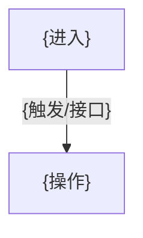

> 现状(as-is)界面业务事实 · 非规范性 · 仅供参考

# {界面名称} — 界面业务梳理

## 一、界面业务描述

### 1.1 业务介绍
{是什么 / 谁用 / 能做什么 / 关键约束}（每句带标注，如 `[runtime+码]` / `~待确认`）

### 1.2 截图
> 占位 —— capture 无截图产物，人工后补。

### 1.3 上下文说明（五维）
- **前置**：{从哪进入}（session_log 导航序列）
- **后置**：{去向哪}（session_log 导航序列）
- **数据**：{读/写的核心业务数据}
- **权限**：{谁可见/可操作}（无显式校验则标 `~待确认`）
- **状态**：{进入/离开时的状态依赖}

## 二、界面功能地图

### 2.1 功能骨架总览
```
{界面名称}
├── 功能点A {标注}
├── 功能点B {标注}
└── 功能点C {标注}
```

### 2.2 功能详细描述
- **功能点A** {标注}
  - 触发方式：{records.ts 录到的真实触发，如"点击列表行『编辑』按钮"}
  - 行为：{做什么；req/resp 字段取自 api_details}
- **功能点B** {标注}
  - 触发方式：…
  - 行为：…

## 三、界面流程图


> 只画本界面内操作流，不串跨界面；只保留结构，禁 classDef/style。
