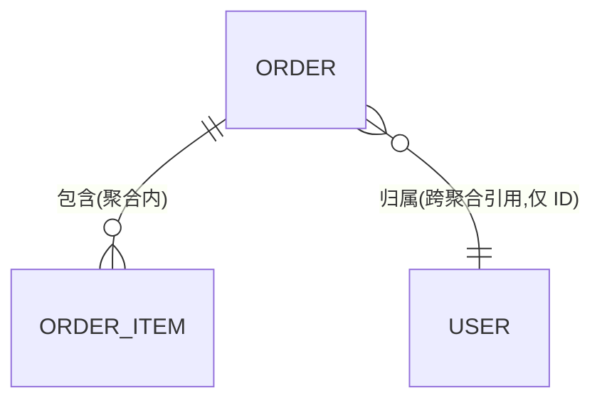
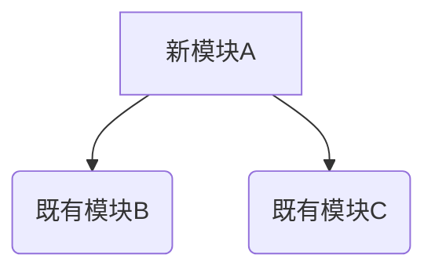
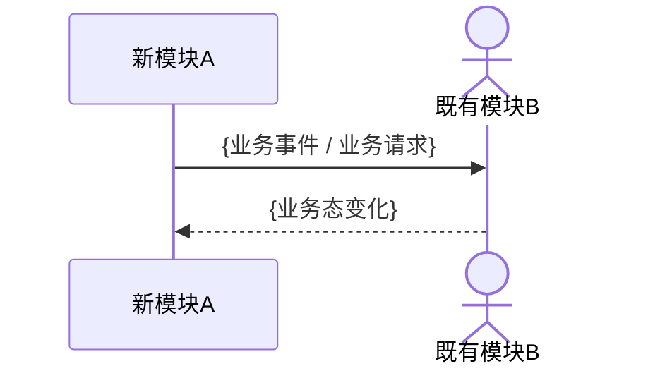

> 红骨架。规则讲解全部在 [`../references/`](../references/)；字段语义见 [`../../shared/contracts/frontmatter-schema.md`](../../shared/contracts/frontmatter-schema.md)。
>
> **核心纪律**：复用既有架构能力，而非另起炉灶。每个 `[新增]` 模块必须通过 §5 ADR 的"复用充分性自检"三问。
>
> **既有架构资产盘点四维**（详见 [`../references/existing-architecture-landscape.md`](../references/existing-architecture-landscape.md)）：D1 既有 BC（§2.1 关系列 + `bc_relations`）/ D2 既有模块（§3.1 标注列 + `reused_modules`）/ D3 既有领域事件（§2.2.1，仅 L3+extended）/ D4 既有 ADR（§5 引用行）。
>
> **按档展开约定**（详见 [`../references/domain-modeling-depth.md`](../references/domain-modeling-depth.md) §1）：
>
> - L1：§2.2 / §3.2 / §4 全部省略；§7 可为"无识别到架构级风险"一行；`bc_relations` 取 `[]`
> - L2：必填 §3.2 模块依赖图、§4 核心流程（≥ 1 条）；§2.2 仍整段省略；`bc_relations` 必非空
> - L3 + extended：在 L2 基础上，额外必填 §2.2（含 §2.2.4 聚合 ER 视图、§2.2.5 领域事件清单）

# {change-name} Design

## §1 架构上下文

- **既有架构引用**：见 frontmatter `architecture_refs`（活字段，含 `path` + `usage`）
  - 例：`{path: docs/auth-arch.md, usage: 扩展}` — 本 change 在 `docs/auth-arch.md §3.2 token 颁发流程` 上做扩展
  - 例：`{path: docs/ARCHITECTURE.md, usage: 约束}` — 本 change 受总体架构约束，不得突破其声明的边界
- **本次 change 的架构定位**：{一句话指出本 change 影响的层 / 边界}
- **不影响的子系统**：{显式列出，作为越界守卫}
- **继承的业务禁区**：已继承 `produced_specs` 中各 spec L0 的业务禁区，本处**不复述**（仅链接）。

## §2 领域建模

### §2.1 限界上下文（BC）

> "与既有 BC 关系"列闭集 = {`沿用`, `扩展`, `新建`, `ACL隔离`, `替换`}（详见 [`../references/existing-architecture-landscape.md`](../references/existing-architecture-landscape.md) §2.1）；与 frontmatter `bc_relations` 严格对齐。

| BC 名称 | 与既有 BC 关系 | 引用的既有 BC | 职责 | 涉及 specs |
|---------|---------------|--------------|------|-----------|
| `BC-{name}` | `沿用` / `扩展` / `新建` / `ACL隔离` / `替换` | `BC-{既有 BC 名}` 或 `—`（新建时） | {一句业务职责} | `specs/{capability}.md` |

### §2.2 战术建模（仅 `domain_model_mode: extended` 展开）

{仅 L3 + extended 时填写；否则整段省略（含标题）。展开规则见 [`../references/domain-modeling-depth.md`](../references/domain-modeling-depth.md) §4}

#### §2.2.1 实体 / 值对象 / 聚合根 / 领域事件（带增量标注）

> 增量标注规则同 §3.1 模块清单：5 项闭集。详见 [`../references/existing-architecture-landscape.md`](../references/existing-architecture-landscape.md) §2.3。

- `[新增]` **实体 `{订单}`**：用户向平台发起的一次购买请求，所属 `BC-order`
- `[已有·扩展]` **聚合根 `{用户}`**：本次在聚合内新增"风险等级"业务概念，**扩展点**：聚合根边界不变
- `[已有·仅引用]` **领域事件 `OrderSubmitted`**：来源 `BC-order`；本 BC 订阅
- `[已有·废弃]` **领域事件 `OrderConfirmed`**：被 `OrderRiskApproved` + `OrderFinalConfirmed` 取代
  - **替代事件**：上述两事件
  - **兼容期窗口**：v2.3 起双发，v3.0 停发

#### §2.2.2 聚合 ER 视图（仅聚合根之间的关系，禁字段类型）

> 单聚合场景可省略本图；**禁止**出现字段类型、主外键、索引。

## §3 模块对外契约

### §3.1 模块清单（含增量标注）

> "增量标注"列闭集 = 5 项 `{[新增], [已有·仅引用], [已有·扩展], [已有·修改], [已有·废弃]}`，与 spec [`../../spec-writer-skill/references/increment-annotation.md`](../../spec-writer-skill/references/increment-annotation.md) 同口径。
> 每行的"既有模块路径"列与 frontmatter `reused_modules` 严格对齐；标 `[已有·*]` 时必填路径，标 `[新增]` 时填 `—` 并触发 §5 ADR "复用充分性自检"三问。

| 模块名 | 增量标注 | 既有模块路径 | 所属 BC | 承接方 | 职责（一句） | 承载的 spec 条目 |
|--------|---------|-------------|---------|--------|-------------|------------------|
| `{module-name}` | `[新增]` | `—` | `BC-{name}` | `{database \| backend \| frontend \| integration \| infra}` | {一句业务职责} | `AC-{req}-01` / `INV-1` |
| `{existing-module}` | `[已有·扩展]` | `services/user-service` | `BC-user` | `backend` | {新增的对外能力} — **扩展点**：{一句话} | `AC-{req}-02` |
| `{existing-api}` | `[已有·修改]` | `POST /api/auth/login` | `BC-auth` | `backend` | {对外契约语义变化，标 `[BREAKING]`} | `AC-{req}-03` |
| `{deprecated-module}` | `[已有·废弃]` | `services/legacy-auth` | `BC-auth` | `backend` | **替代模块**：`services/auth-v2`；**兼容期**：v2.3→v3.0 | `AC-{req}-04` |

> **承接方枚举**（详见 [`../../shared/contracts/handover-domains.md`](../../shared/contracts/handover-domains.md)）：`database` / `backend` / `frontend` / `integration` / `infra`。该列是 task-decomposer 拆解的输入信号，不可省略。
>
> **task-decomposer 协同**：标 `[新增]` 的模块 → task 生成"新建"工单；标 `[已有·扩展]` / `[已有·修改]` 的模块 → task 生成"改造"工单；标 `[已有·仅引用]` 的模块 → task **不生成**工单（仅作依赖追溯）。

### §3.2 模块依赖图（L1 可省；L2/L3 必填）

> 节点视觉约定：**新建模块用矩形 `[...]`**，**既有模块用圆角矩形 `(...)`**，便于 reviewer 一眼识别复用边界。

> 箭头方向 = 依赖方向（同步调用 / 直接引用）；**禁止循环依赖**（CI/CDR 自检项）。
> 异步事件协作不画入本图，放入 §4。

### §3.3 模块对外契约（语义级）

每个模块以`模块.能力(输入概念) → 输出概念`的业务语言描述，详见 [`../references/how-to-write.md`](../references/how-to-write.md) §5。

- **模块 `{module-name}`** `[新增]`
  - 输入：{业务概念，非字段}
  - 输出：{业务态变化，非数据结构}
- **模块 `{existing-module}`** `[已有·扩展]`
  - 既有契约（保持不变）：{原能力的输入 → 输出}
  - 新增契约（本次扩展）：{新能力的输入 → 输出}

## §4 核心流程（L1 可省；L2/L3 至少 1 条）

> 粒度：参与者为**模块级**，不下沉到类 / 函数。只画跨模块链路。
> **新建模块用 `participant`，既有模块用 `actor`** 做视觉区分（可选约定）。

### §4.1 `{flow-name}`（关联 AC: `AC-{req}-01` / `AC-{req}-02`）

**业务意义**：{1-3 行说明本链路承载的业务价值与关联的 AC / INV}

> 纯异步事件流写法：`模块A 产出 {业务事件} → 模块B 消费`，可不画时序图，但须关联 AC / INV。

## §5 ADR（架构决策记录）

### ADR-1：{决策标题}

- **既有 ADR 引用**（**强制**，关系 ∈ `{沿用, 撤销, 修订, 取代}`）：
  - `沿用` `ADR-007: 选用邮箱作为登录主标识`（`docs/adr/007.md`）— 本 ADR 不改其结论
  - 或：`—`（确无相关既有 ADR；必须在 §1 / proposal §0.1 中证明已检索）
- **Context**：{为何需要决策；引用既有架构约束}
- **Decision**：{选择什么}
- **Consequence**：{接受什么取舍}

### ADR-2：{新建模块的复用充分性自检}（每个 `[新增]` 模块对应一条 ADR）

- **既有 ADR 引用**：`—` 或 相关既有 ADR
- **Context**：本 change 引入新模块 `{module-name}`
- **Decision**：新建而非扩展既有，**复用充分性自检三问**：
  1. **检索过 proposal §0.2 的既有代码资产？** → 已检索：`services/user-service` / `services/order-api`
  2. **检索过 design `reused_modules`？** → 已检索（见 frontmatter）
  3. **为何新建而非扩展既有？** → {一句话技术理由，如"既有模块语义边界与本能力不兼容"}
- **Consequence**：{接受新建带来的复杂度增量}

## §6 越界声明 + 复用清单

### §6.1 显式不做（越界声明）

- 不修改 {子系统 X} 的 {能力 Y}
- 不引入新的 {基础设施 Z}

### §6.2 显式复用（反向声明）

> 与 frontmatter `reused_modules` 严格对齐；**`change_mode != greenfield` 时本子节必非空**。

- 复用 `services/user-service` 的"用户身份核验"能力（标注 `[已有·仅引用]`），不另起鉴权链路
- 扩展 `BC-order` 的"草稿订单"业务态（标注 `[已有·扩展]`），不引入新 BC
- 沿用 `ADR-007: 选用邮箱作为登录主标识`，不重开登录主标识选型

## §7 架构级风险（轻量，至少 1 行）

| # | 风险 | 类别 | 概率 | 影响 | 缓解 |
|---|------|------|------|------|------|
| 1 | `{架构级风险描述}` | `{性能 \| 扩展性 \| 耦合 \| 演进}` | 高/中/低 | 高/中/低 | `{架构层缓解策略}` |

> 仅记录**架构级**风险（选型 / 拆分 / 演进）；并发 / 重试 / 异常等实现级风险归 dev skill。
> 若确无识别到架构级风险，保留一行"无识别到架构级风险"（不得整节省略），以保持决策可追溯。

---

## §8 追溯映射（spec ↔ design）

| spec 条目 | design 落点 |
|----------|------------|
| `AC-{req}-01` | §3 模块 `{module-name}` 对外契约 / §4.1 `{flow-name}` |
| `INV-1` | §3 模块 `{module-name}` 业务态约束 |

---

## §9 增量闭环自检（`change_mode != greenfield` 必填；greenfield 整段勾"不适用"）

> 与 spec L4 增量闭环 DoD 同构；本节是 design 阶段的"反腐化自检"。

- [ ] **不适用**（`change_mode: greenfield`）
- [ ] `reused_modules` 已覆盖所有 spec.frontmatter.impacted_modules 的并集（design 不遗漏 spec 已声明的影响）
- [ ] `bc_relations` 每项与 §2.1 BC 表"关系"列严格一致
- [ ] `architecture_refs` 每项的 `usage` 在正文有对应落点（不允许装饰性引用）
- [ ] 每个 `[新增]` 模块在 §5 ADR 中有"复用充分性自检"三问的回答
- [ ] 每个 `[已有·扩展]` 模块紧邻给出**扩展点**一句话说明
- [ ] 每个 `[已有·修改]` 模块在 §5 ADR 中给出契约 Diff，并标 `[BREAKING]`
- [ ] 每个 `[已有·废弃]` 模块给出**替代模块**与**兼容期窗口**
- [ ] §6.2 复用清单非空，且条目与 §3.1 标 `[已有·*]` 的模块一一对应