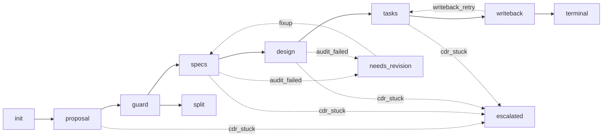

# spec-design-workflow

> AI 编排入口。本文件**只做四件事**:状态机、变更拆分守卫、跨阶段一致性、writeback 协调。
> 全部 skill 内部规则、frontmatter 字段语义、CDR 循环等均**不在本文件**;以链接形式指向 references/ 与 shared/。

---

## 触发条件

- 用户请求"做技术方案"/"开 change"/"启动规约流程"等语义入场。
- 已有 `proposal.md` 起草中,需要驱动到下一阶段(`reviewed → guard → specs → design → tasks → writeback`)。
- 任意阶段产出 `status: reviewed` 后,workflow 自动监听并尝试转移到下一节点。

---

## 不变量

1. **A1 · Workflow ⊥ Skill 解耦**:本 workflow 不复述任何 skill 内规则,不规定模板内容。
2. **A2 · Frontmatter as Contract**:所有跨阶段决策仅基于 frontmatter 字段 [`shared/contracts/frontmatter-schema.md`](../shared/contracts/frontmatter-schema.md),不读 CDR 批注、不读正文实现细节。
3. **零命令名耦合**:与 RBK 协作仅通过字段被动握手,见 [`references/handshake-rbk.md`](./references/handshake-rbk.md);不出现任何 RBK 命令名。
4. **CDR 在阶段内闭环**(C1-5):workflow 不参与 CDR 循环,只监听 `status` 字段。
5. **术语锁定**:使用 `Change-Splitting Guard`(变更拆分守卫)与 `Domain-Modeling Depth`(领域建模深度)两术语;旧术语已禁用(主索引 §6 C2.3-4)。

---

## 四件事 + 1 个降级机制(workflow 的全部职责)

> 第 5 项「失败降级」与前 4 项正交;失败时**不离开 workflow**,通过状态字段降级。详见 [`references/failure-recovery.md`](./references/failure-recovery.md)。

### 1. 状态机

6 主节点 + 3 条失败降级路径;详见 [`references/stage-graph.md`](./references/stage-graph.md) 与 [`references/failure-recovery.md`](./references/failure-recovery.md)。

### 2. 变更拆分守卫(Change-Splitting Guard)

`proposal → guard` 节点的 6 维阈值判定;详见 [`references/change-splitting-guard.md`](./references/change-splitting-guard.md)。

- 任一阈值触发 → 路由到外部 change-decomposition-skill;本次 change 终止
- 全部未触发 → `guard → specs` 转移成立

### 3. 跨阶段一致性 checklist

阶段切换前 workflow 自身校验下列条目(各 skill 内部 checklist 不重叠):

- [ ] Capability Map(proposal §3)与 `specs/*.md` 文件名一一对应(C2.2-5 D4 强约束)
- [ ] `specs/*.md` 的 `related_req` 并集 ⊇ `proposal.related_req_proposal` 中 `[新增]/[已有·扩展]/[已有·修改]/[已有·废弃]` 的 AUTH-ID 子集(C2.2-1 / C2.2-2 / C5-1)
- [ ] `change_mode` 在 proposal / specs/*.md / **design.md** 之间完全一致(spec-writer / design-writer 沿用 proposal;C5-8)
- [ ] `change_mode != greenfield` 时,各 spec 的 `reference_specs`(spec 视角=既有锚)/ `touched_capabilities` / `impacted_modules` **至少一个非空**
- [ ] **`change_mode != greenfield` 时,design.reused_modules 必非空**(C5-8 design 增量字段联动)
- [ ] **design.reused_modules[].path 集合 ⊇ 各 spec.impacted_modules 的并集**(C5-9 design 不遗漏 spec 影响)
- [ ] **design.bc_relations[].bc 集合 == design.bounded_contexts**(C5-10 BC 关系字段一一对应;L1 时双侧均为 `[]`)
- [ ] **design.bc_relations[].relation ∈ DDD 5 项闭集 `{沿用, 扩展, 新建, ACL隔离, 替换}`**(C5-10)
- [ ] **design.architecture_refs[] 每项含 `path` + `usage`,且 `usage` ∈ `{沿用, 扩展, 约束, 替换}`**(C5-11 活字段)
- [ ] proposal §0.1 / §0.2 的具体条目分别可在各 spec 的 `reference_specs` / `touched_capabilities` / `impacted_modules` 中找到映射(双向追溯)
- [ ] design 中引用的章节 / 模块在 `tasks` 的"关联 design 落点"字段中可达
- [ ] `tasks.handover_domains` ⊆ [`shared/contracts/handover-domains.md`](../shared/contracts/handover-domains.md) 闭集
- [ ] `change_name` 在 4 类文件中完全一致;`bounded_contexts` 在 design 与 tasks 之间符合子集语义
- [ ] `domain_modeling_level` 在 design 与 tasks 之间一致(Q1-1 / Q2.4-2 留 Stage 4 audit 兜底)

> 各 skill 内 references/checklist.md 校验阶段内规则;本表只校验**跨阶段**字段一致性,不重叠。

### 4. Writeback 协调

`tasks.exc_status == done` 触发 `tasks → writeback` 转移后,workflow 执行下列纯字段操作:

1. 解析 `tasks.related_design` → design 路径
2. 解析 design 的 `produced_specs` → specs/*.md 列表
3. 扫描各 spec L4 DoD 已勾选 `[x]` 的 US-ID
4. 写入 `tasks.shipped_us` 字段(C1-4:workflow 唯一写此字段)
5. RBK 监听 `shipped_us` 完成账本打勾;workflow 不主动调用 RBK

详见 [`references/handshake-rbk.md`](./references/handshake-rbk.md) §4。

---

## 状态转移条件表(对照检索)

### 正向(happy path)

| From → To | 条件 |
|-----------|------|
| `init → proposal` | 用户请求"做技术方案" |
| `proposal → guard` | `proposal.status == reviewed` |
| `guard → specs` | 6 维阈值全部未触发 + frontmatter 合法 |
| `guard → split` | 6 维阈值任一触发 → 外部 change-decomposition-skill |
| `specs → design` | 全部 `specs/*.status == reviewed` + 跨阶段 checklist 通过 |
| `design → tasks` | `design.status == reviewed` + 跨阶段 checklist 通过 |
| `tasks → writeback` | `tasks.exc_status == done` |
| `writeback → terminal` | `tasks.shipped_us` 已注入 |

### 失败降级(详见 [`references/failure-recovery.md`](./references/failure-recovery.md))

| From → To | 条件 | 状态写入 |
|-----------|------|---------|
| `specs/design (reviewed) → needs_revision` | 跨阶段 checklist 任一失败 / validator 失败 | 对应文件 `status: needs_revision` |
| `needs_revision → draft` | 用户/skill 修复违例 | 对应文件 `status: draft` |
| `任一阶段(draft) → escalated` | CDR ≥ 6 轮未收敛 | 对应文件 `status: escalated` |
| `escalated → draft` | 用户人工裁决批注 | 对应文件 `status: draft` |
| `writeback → tasks` | writeback 数据构造异常(F3) | `tasks.exc_status: writeback_failed` |
| `writeback_failed → done` | 用户修复后手动改回 | `tasks.exc_status: done` 重试 writeback |

> 字段语义见 [`shared/contracts/frontmatter-schema.md`](../shared/contracts/frontmatter-schema.md);正向转移详见 [`references/stage-graph.md`](./references/stage-graph.md);失败降级详见 [`references/failure-recovery.md`](./references/failure-recovery.md)。

---

## 与 4 个 skill 的协作

workflow 仅在阶段切换时**指路到**对应 SKILL.md;不读取 skill 内 references/*。

| 节点 | 路由 SKILL.md |
|------|--------------|
| proposal | [`../proposal-writer-skill/SKILL.md`](../proposal-writer-skill/SKILL.md) |
| specs | [`../spec-writer-skill/SKILL.md`](../spec-writer-skill/SKILL.md) |
| design | [`../design-writer-skill/SKILL.md`](../design-writer-skill/SKILL.md) |
| tasks | [`../task-decomposer-skill/SKILL.md`](../task-decomposer-skill/SKILL.md) |

各 skill 之间**互不引用**(主索引 §6 C2.1-1);跨 skill 协作仅通过字段写读流(见 schema §3 / handshake-rbk §3)。

---

## 与 RBK 的协作

仅通过 frontmatter 字段被动握手:

| 时机 | workflow 字段动作 | RBK 监听字段 |
|------|------------------|--------------|
| proposal 产出后 | 监听 `req_ledger_state` | RBK 监听同字段 |
| spec 产出后 | 监听 `related_req` | RBK 监听同字段 |
| writeback 阶段 | **写入** `shipped_us` | RBK 监听同字段 |

> 详细规则与禁令见 [`references/handshake-rbk.md`](./references/handshake-rbk.md);workflow 不调用 RBK 任何能力,RBK 也不调用 workflow。

---

## 文件导航

| 文件 | 用途 |
|------|------|
| [`README.md`](./README.md) | 给"人"看的安装/概览 |
| [`references/stage-graph.md`](./references/stage-graph.md) | 6 节点正向状态机详解 + 阶段切换守卫 |
| [`references/change-splitting-guard.md`](./references/change-splitting-guard.md) | 6 维阈值判定与拆分路由 |
| [`references/handshake-rbk.md`](./references/handshake-rbk.md) | 与 RBK 字段握手 / writeback 数据构造 |
| [`references/failure-recovery.md`](./references/failure-recovery.md) | 3 条失败降级路径(audit_failed / cdr_stuck / writeback_retry) |

---

## 严禁事项 / 不做边界

workflow **不做**下列事项,触发即视为越界(主索引 §3 A1 / Hard Bans):

1. **不规定 skill 内容**:不写"proposal §X 该写什么"/"design 章节如何展开"等正文规则。
2. **不定义 frontmatter 字段语义**:字段语义权威在 [`shared/contracts/frontmatter-schema.md`](../shared/contracts/frontmatter-schema.md);本 workflow 仅引用字段名。
3. **不参与 CDR**:不发起、不复述、不消化批注;CDR 在阶段内由各 skill 自治闭环。
4. **不调用命令**:不调用 RBK 任何能力,不调用任何 skill 的 references/* 文件。
5. **不直接写账本**:`docs/spec/REQUIREMENTS.md` / `docs/spec/ROADMAP.md` 由 RBK 自治。
6. **失败必降级,不甩锅**:阶段内卡死或 audit 失败时按 [`references/failure-recovery.md`](./references/failure-recovery.md) 的 3 条路径写入 `needs_revision` / `escalated` / `writeback_failed`,**不允许**保持原状继续等待。
7. **不出现旧术语**:`复杂度守卫` / `复杂度梯度` 全文 0 出现(检测豁免:本节"严禁事项"中陈述的反例)。
8. **不中文枚举**:`status` / `exc_status` 严守小写英文枚举。
9. **不引用 sibling skill 的 references/*** :仅链 SKILL.md 入口或 shared/。

---

## 阶段切换前自检(workflow 自身)

每次阶段切换前 workflow 必须确认下列前提(对应 stage-graph §4 + 跨阶段 checklist):

- [ ] 上一阶段 `status == reviewed`
- [ ] 跨阶段 checklist 全部勾选(本文件"四件事 §3")
- [ ] 字段合法性(frontmatter ⊆ schema §1 + 枚举 ∈ §4.3 闭集)
- [ ] 路径可达(`reference_specs` / `produced_specs` / `related_design` 指向的文件存在)

未通过则**拒绝转移**,workflow 状态保持原节点。

---

## 触发后的运行约定

- workflow 不创建 / 修改任何文件正文,只监听 frontmatter 与 `status` 字段(writeback 时写入 `shipped_us` 例外)。
- workflow 不与用户对话内容判断决策,仅以字段为准。
- 用户可绕开 workflow 独立运行 4 个 skill 中任何一个或独立调用 RBK,workflow 在此情形下退化为零。