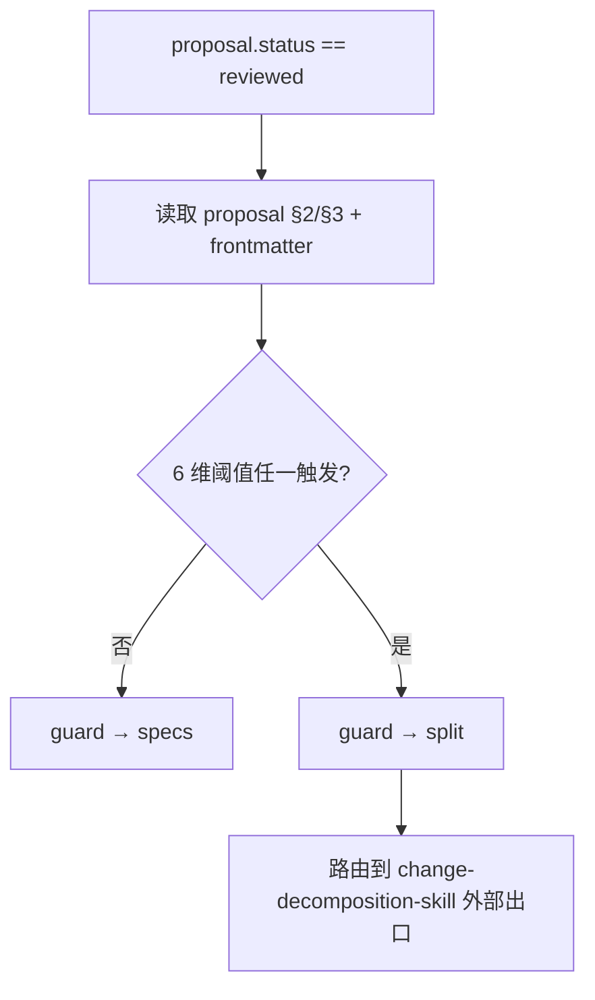

# Change-Splitting Guard — 变更拆分守卫

> 本文件是 [`./stage-graph.md`](./stage-graph.md) 中 `proposal → guard → specs/split` 节点的判定权威。
> 仅回答"是否需要把本次 change 拆成多个独立 change",**不回答**"design 中领域建模到什么深度"(后者由 [`design-writer-skill`](../../design-writer-skill/SKILL.md) 主导,详见其 references)。
>
> **术语锁定**:本文件使用 `Change-Splitting Guard`(变更拆分守卫);**禁用旧术语** `复杂度守卫` / `复杂度梯度`(主索引 §6 C2.3-4)。

---

## §1 守卫定位

- **触发时机**:`proposal.status == reviewed` 后、进入 specs 阶段之前。
- **判定主体**:workflow 自身(不路由 skill)。
- **判定输入**:proposal.md 正文与 frontmatter 的纯字段读取;**不读** specs / design / tasks(它们尚未存在)。
- **判定输出**:`pass`(全部未触发) → `guard → specs`;`split`(任一触发) → `guard → split` 路由到外部 change-decomposition-skill。

> 守卫与 CDR 正交:守卫不在 CDR 循环内。CDR 在阶段内闭环,守卫在阶段切换边界判定。

---

## §2 6 维阈值表

| # | 维度 | 阈值 | 数据来源 | 触发后果 |
|---|------|------|---------|---------|
| 1 | Capability Map 模块数量 | > 3 | proposal §3 Capability Map 行数 | 任一触发即拆 |
| 2 | 预估 Task 数量(粗估) | > 15 | proposal §2 Proposed Changes 行数 × 系数 | 同上 |
| 3 | 涉及独立服务 / 独立部署单元 | ≥ 2 | proposal §2 影响范围列 | 同上 |
| 4 | 跨数据域且有数据依赖 | ≥ 2 个数据域 | proposal §3 Capability 描述 | 同上 |
| 5 | 预估 Spec 文档总体积 | 单文档 > 3000 字 | 经验估算 | 同上 |
| 6 | 关联 AUTH-ID 数量 | > 5 | `proposal.related_req_proposal` 长度 | 同上 |

> 阈值同旧 spec-design-skill SKILL.md §阶段 1.5 沿用,**不引入新阈值**;术语全部更新为 v2 词汇。

---

## §3 判定流程

> workflow 仅做布尔判定,不做"为什么触发"的诊断陈述;诊断由用户在路由后进入 change-decomposition-skill 自行展开。

---

## §4 阈值未触发时的"通过"判据

`guard → specs` 转移成立须同时满足:

- 6 维阈值**全部未触发**
- `proposal.req_ledger_state` ∈ {`present`, `missing`, `skipped`}(任一合法值即可,不约束具体值)
- `proposal.related_req_proposal` 是合法 AUTH-ID 数组(C2.2-3:不允许 `AUTH-*` 通配符)

> 第 2、3 条属于 frontmatter 字段合法性,字段非法时不进入守卫(workflow 拒绝转移到 guard 节点)。

---

## §5 拆分后的处置

触发拆分时,workflow 不直接生成子 change;路由到外部 change-decomposition-skill 后,本次 change 的 workflow 状态机终止。各 change 独立进入新的 `init → proposal` 流程。

**特别约束(C2.2-5 D4 强约束传递)**:拆分时若一条 AUTH 被多个子 change 覆盖,违反"一 AUTH 一 spec"。处置仅二选一:

- 拆 AUTH:把跨子 change 的 AUTH-ID 进一步拆细
- 合并 capability:回到 proposal 阶段合并 capability 后重启守卫

> workflow 不强制选哪一种,但**不允许第三种"软放过"**。

---

## §6 与 Domain-Modeling Depth 的边界(易混淆)

| 维度 | Change-Splitting Guard(本文件) | Domain-Modeling Depth(design-writer 内部) |
|------|--------------------------------|-------------------------------------------|
| 回答的问题 | 是否拆 change | design 是否展开领域建模 |
| 主导 | workflow | design-writer-skill |
| 时机 | proposal → specs 边界 | design 阶段内 |
| 输出 | `pass` / `split` | `L1` / `L2` / `L3` |
| 输入 | proposal 字段 | design 自身判定(C2.3-3 L3 须用户确认) |

> 两者**正交**;Change-Splitting Guard 通过后,L1/L2/L3 是 design 内部的纵向选择。

---

## §7 严禁事项 (Hard Bans)

- 不得使用旧术语"复杂度守卫"/"复杂度梯度"
- 不得在守卫判定中读取 specs / design / tasks 正文(它们尚未存在;若已存在则非法)
- 不得引入新阈值或调整既有阈值数值(主索引 §6 C0-x / C1-x 未授权)
- 不得在守卫内做 CDR 批注循环(C1-5:workflow 不参与 CDR)
- 不得绕过守卫直接 `proposal → specs`(任何路径必须先经过 guard 节点)

---

## §8 校验规则(供 Stage 4 审计)

- 全文不出现"复杂度守卫" / "复杂度梯度"(0 命中)
- 阈值表 6 维与本文件 §2 完全一致;不允许在 WORKFLOW.md 复述阈值数值
- 不出现"调用 RBK"等命令名
- `Change-Splitting Guard` 与 `Domain-Modeling Depth` 二术语在全文出现时各自指向唯一文件