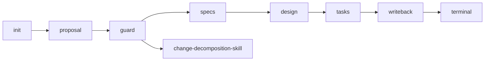

# Stage Graph — 编排状态机详解

> 本文件是 [`../WORKFLOW.md`](../WORKFLOW.md) §状态机段的展开版本。
> 仅描述阶段节点、转移条件、与 4 个 skill 的路由路径;**不重述** skill 内规则、不定义 frontmatter 字段语义、不参与 CDR。

---

## §1 阶段节点(6 节点闭集)

| 节点 | 含义 | 主导者 |
|------|------|--------|
| `init` | 用户提出"做技术方案"意图 | workflow |
| `proposal` | proposal.md 起草中 | proposal-writer-skill |
| `guard` | Change-Splitting Guard 判定中 | workflow |
| `specs` | specs/*.md 起草中 | spec-writer-skill |
| `design` | design.md 起草中 | design-writer-skill |
| `tasks` | tasks.md 起草中 | task-decomposer-skill |
| `writeback` | 收尾打勾 | workflow |
| `terminal` | change 终态 | — |

> `guard` 是唯一由 workflow 自身主导(不路由 skill)的节点;`writeback` 同样不调用任何 skill。

---

## §2 阶段流转图

> `split` 不是本 workflow 的内部节点,是外部 skill 路由出口;触发后本次 change 终止,各子 change 独立重跑。

---

## §3 转移条件表

| From → To | 条件(仅基于 frontmatter) | 校验位置 |
|-----------|---------------------------|----------|
| `init → proposal` | 用户请求"做技术方案" | workflow 路由 |
| `proposal → guard` | `proposal.status == reviewed` | workflow 监听 |
| `guard → specs` | Change-Splitting Guard 6 维阈值**全部未触发** | [`./change-splitting-guard.md`](./change-splitting-guard.md) |
| `guard → split` | 6 维阈值**任一触发** → 路由到 change-decomposition-skill(外部) | 同上 |
| `specs → design` | 全部 `specs/*.md` 的 `status == reviewed`,且 `related_req` 并集 ⊇ proposal `related_req_proposal` 子集(D4 强约束) | workflow 监听 |
| `design → tasks` | `design.status == reviewed` | workflow 监听 |
| `tasks → writeback` | `tasks.exc_status == done` | workflow 监听 |
| `writeback → terminal` | `tasks.shipped_us` 已注入,RBK 已完成账本打勾 | workflow 自身 |

> 转移条件**只读**字段,**不读**正文;不读 CDR 批注内容(C1-5)。

---

## §4 阶段切换守卫(基于 CDR 反向分流的传递)

每次阶段切换前,workflow 必须验证下列前提全部成立(否则拒绝转移):

- 上一阶段 `status == reviewed`(等价于上一阶段 CDR 退出条件全部满足,见 [`../../shared/protocols/cdr-protocol.md`](../../shared/protocols/cdr-protocol.md) §6)
- 上一阶段所有"反推上游"批注已回上游修订完毕(C2.1-3 / C2.2-4 / C2.3-1 / C2.4-1 各 skill 自行保证;workflow 仅以 `status` 为准)
- `change_name` 在已存在的全部文件中完全一致
- `domain_modeling_level` / `bounded_contexts` 在 design 与 tasks 之间沿用一致(子集语义,Q2.4-2 留 Stage 4 audit 兜底)

---

## §5 与 4 个 skill 的路由路径

| 节点 | 路由到 | SKILL.md 路径 |
|------|--------|--------------|
| `proposal` | proposal-writer-skill | [`../../proposal-writer-skill/SKILL.md`](../../proposal-writer-skill/SKILL.md) |
| `specs` | spec-writer-skill | [`../../spec-writer-skill/SKILL.md`](../../spec-writer-skill/SKILL.md) |
| `design` | design-writer-skill | [`../../design-writer-skill/SKILL.md`](../../design-writer-skill/SKILL.md) |
| `tasks` | task-decomposer-skill | [`../../task-decomposer-skill/SKILL.md`](../../task-decomposer-skill/SKILL.md) |

> workflow 仅**指路**(转移到该路径),不引用各 skill 的 references/*。各 skill 内部规则对 workflow 不可见。

---

## §6 终止条件与异常分支

### §6.1 正常终止

`writeback → terminal` 完成,本次 change 全周期结束。

### §6.2 异常分支

| 触发 | workflow 行为 |
|------|--------------|
| 任意 frontmatter 字段非 schema §4.3 闭集枚举值 | 拒绝转移,提示用户修复 |
| 阶段切换时上一阶段 `status != reviewed` | 拒绝转移,回到上一阶段 |
| guard 触发拆分 | 路由到外部 change-decomposition-skill,本次 change 终止 |
| `tasks.exc_status` 长期停留 `in_progress` | workflow 不主动干预(由 dev skill 自驱);CDR 在阶段内闭环 |

> workflow 不参与 CDR(C1-5),不诊断阶段内卡死。

---

## §7 与其他 workflow 文档的边界

- 6 维阈值定义 → 见 [`./change-splitting-guard.md`](./change-splitting-guard.md),本文件仅声明"全部未触发"作为转移条件
- 与 RBK 的字段握手 → 见 [`./handshake-rbk.md`](./handshake-rbk.md),本文件不复述 RBK 行为
- frontmatter 字段语义 → 见 [`../../shared/contracts/frontmatter-schema.md`](../../shared/contracts/frontmatter-schema.md)
- CDR 退出条件 → 见 [`../../shared/protocols/cdr-protocol.md`](../../shared/protocols/cdr-protocol.md) §6
- **失败降级 3 条路径(audit_failed / cdr_stuck / writeback_retry)→ 见 [`./failure-recovery.md`](./failure-recovery.md);本文件只画正向状态机**
- skill 内规则(模板结构、validation、references)对 workflow **不可见**

---

## §8 校验规则(供 Stage 4 审计)

- 全文不得出现"调用 RBK"/"U1"/"U2"/"U4"/"U5"/"U6"等命令名
- 全文不得出现"复杂度守卫"/"复杂度梯度"
- 转移条件中出现的字段必须在 [`../../shared/contracts/frontmatter-schema.md`](../../shared/contracts/frontmatter-schema.md) §1 表中存在
- 不得出现 sibling skill 的 references/* 链接(只能链 SKILL.md 入口或 shared/)