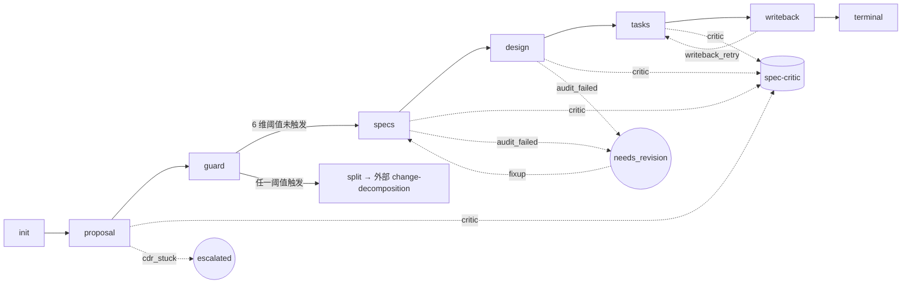

# spec-wf 总览(v3)

> 一份 AI 辅助开发的**四步规约工作流 + 软门审查 + 工程脚本**的 skill 组合:把"想做什么"逐层翻译为"该如何做",每一步强制做**增量优先 + 既有资产复用**的显式标记;最终把规约文档作为代码生成的唯一真理来源,并配套 deterministic 校验器与 LLM-as-Judge 软门双轨兜底。术语「软门」由 [`spec-critic-skill/SKILL.md`](spec-critic-skill/SKILL.md) §角色定位单点定义。

---

## 一、设计目标

把"先契约、后执行"做成**可机械校验**的工程纪律。具体回答 4 个问题 + 1 个保障:

| 问题 | 谁来回答 | 产出 |
|------|---------|------|
| 为什么做、做什么? | proposal-writer | `proposal.md` |
| 业务上怎样算做对? | spec-writer | `specs/*.md` |
| 架构上如何切分与复用? | design-writer | `design.md` |
| 拆给谁、做什么工单? | task-decomposer | `tasks.md` |
| 产物质量如何兜底? | **spec-critic** (软门) + `scripts/validate.mjs` (硬门) | `critic.md` + 三态裁决 + 退出码 |

**编排谁来管?** → `spec-design-workflow`(状态机 + 拆分守卫 + 跨阶段一致性 + writeback + **失败降级 3 路径**)。
**横切契约谁来管?** → `shared/contracts/` + `shared/protocols/` + `shared/templates/`(frontmatter、AC 词表、统一动词表、CDR、TodoWrite shadow、空值约定、渐进披露、references 骨架)。

---

## 二、三条主轴(贯穿不变量)

| 主轴 | 含义 | 落地 |
|------|------|------|
| **A1 · Workflow ⊥ Skill 解耦** | 编排顺序在 workflow;阶段能力在 skill;二者物理拆分 | 4 个 writer skill 互不引用;spec-critic-skill 独立;workflow 不读 skill 内 references |
| **A2 · Frontmatter as Contract** | 跨 skill / 跨阶段协作仅通过 frontmatter 字段 | [`shared/contracts/frontmatter-schema.md`](shared/contracts/frontmatter-schema.md) 是唯一字段权威 + JSON Schema 镜像 [`frontmatter.schema.json`](shared/contracts/frontmatter.schema.json);零命令名耦合 |
| **A3 · Progressive Disclosure** | SKILL.md ≤ 65 行作为入口;规则下沉 `references/`;横切下沉 `shared/` | 详见 [`shared/protocols/progressive-disclosure.md`](shared/protocols/progressive-disclosure.md);references 结构遵循 [`shared/templates/writer-references-template.md`](shared/templates/writer-references-template.md) |

---

## 三、目录结构(完整)

```
spec_wf/
├── spec-design-workflow/           # 编排层(状态机 + 守卫 + 一致性 + writeback + 失败降级)
├── proposal-writer-skill/          # 阶段一:战略对齐
├── spec-writer-skill/              # 阶段二:业务规约
├── design-writer-skill/            # 阶段三:架构契约(含 L3 ToolCall 确认门)
├── task-decomposer-skill/          # 阶段四:工单拆解(可 shadow 出 TodoWrite)
├── spec-critic-skill/              # 软门(LLM-as-Judge,三态裁决)
├── requirements-bookkeeping-skill/ # 项目级账本(REQUIREMENTS.md / ROADMAP.md;字段被动握手)
├── shared/                         # 横切契约 + 行为协议 + 模板
│   ├── glossary.md                     # spec-wf 术语对齐表(跨文件语义锚点 / 速查索引)
│   ├── contracts/
│   │   ├── frontmatter-schema.md       # 字段权威(20 字段,human-readable)
│   │   ├── frontmatter.schema.json     # 字段权威(JSON Schema,machine-checkable)
│   │   ├── ac-vocabulary.md            # INV / AC / DoD 三层口径
│   │   ├── handover-domains.md         # 5 项承接方闭集
│   │   ├── empty-value-convention.md   # 空值统一写法
│   │   └── change-verbs.md             # 9 词统一动词词表 + 5 处 sub-select
│   ├── protocols/
│   │   ├── cdr-protocol.md             # 注释驱动精炼 + 对话→批注转译(§4.1)
│   │   ├── clarification-gate-protocol.md  # 生成前澄清闸门(CG),proposal 强制
│   │   ├── progressive-disclosure.md   # 渐进披露
│   │   └── tasks-to-todowrite.md       # tasks.md → TodoWrite shadow output 协议
│   └── templates/
│       └── writer-references-template.md  # 4 writer references 结构骨架
├── scripts/
│   ├── package.json                    # ajv / js-yaml 依赖
│   └── validate.mjs                    # 唯一对外校验器:schema + 跨阶段 invariant (I-A~I-F) + audit 钩子 (C1~C7)
├── MAINTENANCE.md                      # 维护者指南(eval 回归测试 / schema 演进流程 / 演化历史)
├── USER-GUIDE.md                       # AI 开发用户上手指南(完整示例)
└── spec-wf总结.md                       # 本文件(设计原理)
```

每个 writer skill 内部固定 4 件套:

```
{writer}-skill/
├── SKILL.md           # AI 入口(≤ 65 行,触发条件 / 不变量 / 输入输出 / 文件导航)
├── README.md          # 给人看的概览
├── templates/         # 红骨架模板(字段位 + 小节标题 + 占位符)
└── references/        # 写作指南 / 验收清单 / 规则细则 / **redlines.md**(严禁事项)
                       # 结构骨架见 shared/templates/writer-references-template.md
```

spec-critic-skill 也遵循同一布局(无 templates/,因为 critic.md 是 critic skill 内置格式)。

---

## 四、四步工作流(核心) + 软门



| 节点 | 输入 | 产出 | 关键纪律 |
|------|------|------|---------|
| **proposal** | 用户意图 + 项目级账本 `REQUIREMENTS.md` | `proposal.md` | §0 既有资产盘点(greenfield 可折叠为单行,非 greenfield 三表必填);Backout;决策前自检 5 项;不涉及实现细节 |
| **guard**(workflow 内) | proposal frontmatter | `pass` / `split` | 6 维阈值(Capability 数 / Task 数 / 独立部署单元 / 数据域 / 规模 / AUTH 数) |
| **specs** | proposal | `specs/{capability}.md`(每能力一份) | L0–L4 严格分层;AC 唯一来源 = L2 INV ∪ L3 AC ∪ DMN-Rn;L4 零新增;增量标注 5 项闭集 |
| **design** | specs | `design.md`(单文件) | 8 段结构;BC 关系 DDD 5 项;模块 5 项闭集;**L3 必经 ToolCall 确认门 + `<!-- l3-confirmation -->` 留痕**;复用充分性自检三问;边界红线 |
| **tasks** | design | `tasks.md`(可由 host 同步生成 TodoWrite shadow output) | `BC × 承接方` 二维切分;7 字段必填;不复活旧 Phase 流水线 |
| **writeback** | tasks | `shipped_us` 注入 | workflow 唯一写字段;RBK 监听打勾;失败写 `<!-- writeback-failure -->` 注释 |
| **critic** (软门,任一阶段 reviewed 后) | 阶段产物 | `critic.md` + verdict 三态 | `pass` / `needs_revision`(→ F1) / `escalated`(→ F2);不改正文 |

---

## 五、增量优先(现实主义工程纪律)

> **现实中绝大多数需求都是基于既有工程做迭代/新增**——三阶段叠加显式标注既有资产,从源头反腐化。

### 5.1 三视角正交,叠加而非复述

| 阶段 | 既有对象视角 | 字段载体 | 词表(均 sub-select 自 [`change-verbs.md`](shared/contracts/change-verbs.md)) |
|------|------------|---------|------|
| proposal §0 | **业务/工程级**——"哪些被触达" | `change_mode` / §0.1 / §0.2 / §0.3 | 关系列 6 项:沿用 / 扩展 / 修改 / 废弃 / 替换 / 并存 |
| spec L0.x | **业务级**——"业务规则原本是什么" | `touched_capabilities` / `impacted_modules` / `reference_specs` + 行级标注 | **增量标注 5 项闭集** `{[新增], [已有·仅引用], [已有·扩展], [已有·修改], [已有·废弃]}` |
| design | **架构级**——"工程结构原本是什么" | `reused_modules` / `bc_relations` / `architecture_refs` / `produced_specs` | BC 用 **DDD 5 项** `{沿用, 扩展, 新建, ACL隔离, 替换}`;模块用 5 项闭集;架构 usage 4 项 `{沿用, 扩展, 约束, 替换}` |

**关键纪律**:proposal §0.2 → spec.impacted_modules → design.reused_modules 通过 ⊇ 关系形成**追溯链**,design 不允许遗漏 spec 已声明的影响(由 [`scripts/validate.mjs`](scripts/validate.mjs) I-B 校验)。

### 5.2 `change_mode` 联动强约束

| `change_mode` | 触发的强制项 |
|---------------|------------|
| `greenfield` | **§0 整节可折叠**为单行声明;增量字段可为 `[]` |
| `extend` | 增量标注必含 `[已有·扩展]`/`[已有·仅引用]`;spec 三字段至少一非空;design `reused_modules` 必非空 |
| `refactor` | 必含 `[已有·修改]` 或 `[已有·废弃]`;附 Diff 表 / 迁移路径 + 兼容期窗口 |
| `bugfix` | 必含 `[已有·修改]`;附 Diff 表 |

### 5.3 复用充分性自检(design 核心反腐化)

每个标 `[新增]` 的模块必须在 §5 ADR 中显式回答三问:
1. 已检索 proposal §0.2 的既有代码资产?
2. 已检索 design `reused_modules`?
3. 为何新建而非扩展既有?

未答即视为"凭直觉造新模块",audit 与 critic 共同拒绝。

---

## 六、frontmatter 字段流(A2 主轴落地,20 字段)

跨 skill 协作仅靠字段读写。每个 skill 的"读什么 / 写什么"如下:

| skill | 读 | 写 |
|-------|----|----|
| **proposal-writer** | 用户意图 + `REQUIREMENTS.md`(初次) | `change_name` / `status` / `change_mode` / `req_ledger_state` / `related_req_proposal` |
| **spec-writer** | `change_mode` / `related_req_proposal` | `related_req` / `reference_specs`(既有锚)/ `touched_capabilities` / `impacted_modules` / `milestone` |
| **design-writer** | `change_mode` / `impacted_modules` / `touched_capabilities` | `produced_specs`(本 change 自产)/ `architecture_refs` / `domain_modeling_level` / `domain_model_mode` / `bounded_contexts` / `reused_modules` / `bc_relations` |
| **task-decomposer** | `domain_modeling_level` / `bounded_contexts` / `produced_specs` / `impacted_modules` / `reused_modules` / `bc_relations` | `related_design` / `handover_domains` / `exc_status` |
| **workflow** | 各 file.status / `tasks.exc_status` / `change_mode` | `tasks.shipped_us`(writeback)/ `{target}.status: needs_revision/escalated`(F1/F2)/ `tasks.exc_status: writeback_failed`(F3) |
| **spec-critic** | 阶段产物正文 | `critic.md`(独立文件)+ `{target}.status` 三态副作用 |
| **RBK** | `req_ledger_state` / `related_req` / `shipped_us`(被动监听) | `REQUIREMENTS.md` / `ROADMAP.md`(自治,本套不写) |

**关键约束**:
- `related_specs` 拆为 `reference_specs`(spec 引既有)+ `produced_specs`(design 引本 change),消除同名异义
- `status` 枚举 `{draft, reviewed, needs_revision, escalated}`;`exc_status` 含 `writeback_failed`
- spec-critic 是除 workflow writeback 外**唯一被允许写他人 status** 的 skill
- **3 个握手点**(与 RBK 协作):① proposal 起手读 `REQUIREMENTS.md` → 写 `req_ledger_state` ② spec 写 `related_req` ③ writeback 写 `shipped_us`

---

## 七、横切机制

### 7.1 CDR(注释驱动精炼)+ 对话转译

每阶段**强制 1-6 轮**"生成 → 批注 → 修正"循环;严禁 one-shot。**v3 起允许对话→批注自动转译**,降低用户手写 inline comment 的摩擦。

| 阶段 | 分流路数 | 特别说明 |
|------|---------|---------|
| proposal | 单向下推(实现细节 → design / 工程闭环 → dev) | — |
| spec | 4 路(战略反推 proposal / 规约消化 / 实现下推 design / 工程下推 dev) | — |
| design | **反向 5 路**(战略反推 / 规约反推 / 实现消化 / 复用建议消化 / 工程下推) | 中段位置,双向接批注 |
| task | 反向 4 路(战略/规约暂停 / 粒度消化 / 实现+工程转 dev) | — |

**对话转译协议**(`<!-- comment-from-chat (@ts, turn-N): 「用户原话」 -->`)详见 [`shared/protocols/cdr-protocol.md`](shared/protocols/cdr-protocol.md) §4.1。

### 7.2 AC 三层口径(spec 核心)

| 口径 | 编号 | 来源层 | 形态 |
|------|------|--------|------|
| 数据级 AC | `INV-x` | L2 | 业务永真规则 |
| 功能级 AC | `AC-{req}-{seq}` | L3 | EARS + Gherkin |
| 规则级 AC | `DMN-xxx-Rn` | L3 决策表(按需启用) | 决策表行 |
| 完成定义 | DoD | L4 | **零新增**复选框,反向引用 INV / AC / DMN |

详见 [`shared/contracts/ac-vocabulary.md`](shared/contracts/ac-vocabulary.md)。

### 7.3 关键守卫

| 守卫 | 时机 | 作用 | 强制度 |
|------|------|------|-------|
| **Change-Splitting Guard** | proposal → specs 边界 | 6 维阈值判定是否拆 change | 硬(workflow 拒绝转移) |
| **L3 ToolCall 确认门**([`design-writer-skill/references/depth-confirmation.md`](design-writer-skill/references/depth-confirmation.md)) | design 写 `domain_modeling_level` 前 | L3 必经"问→答"门 + `<!-- l3-confirmation -->` 留痕 | 硬(critic-checks C1 强制) |
| **复用充分性自检** | design `[新增]` 模块 | ADR 三问 | 硬(audit / critic 拒绝) |
| **D4 强约束** | spec | 一条 AUTH 只能归属一个 spec | 硬([`scripts/validate.mjs`](scripts/validate.mjs) I-E) |
| **边界红线** | 各 writer | 见各自 `references/redlines.md` | 硬(critic / audit 拒绝) |
| **跨阶段 invariant I-A ~ I-F** | 阶段切换 | change_name / change_mode 一致;reused⊇impacted;bc_relations⊆bounded_contexts;AUTH 唯一所有权;shipped_us 写入 | 硬(validator 退出 1) |
| **audit 钩子 C1 ~ C7** | 任意时刻 | L3 留痕 / writeback 注释 / critic.md 格式 / needs_revision 老化 / CG 闸门留痕 | C1-C5, C7 硬 / C6 soft |

### 7.4 失败降级 3 路径

workflow 不再"甩锅给用户";失败必有显式状态字段表达,详见 [`spec-design-workflow/references/failure-recovery.md`](spec-design-workflow/references/failure-recovery.md):

| ID | 名称 | 触发 | 状态写入 | 解除方式 |
|----|------|------|---------|---------|
| F1 | `audit_failed` | 跨阶段 checklist / validator 失败 / **critic verdict=needs_revision** | `{target}.status: needs_revision` | 用户修复后回 `draft` 走 CDR |
| F2 | `cdr_stuck` | CDR ≥ 6 轮未收敛 / **critic verdict=escalated** | `{target}.status: escalated` | 用户人工裁决批注后回 `draft` |
| F3 | `writeback_retry` | writeback 数据构造异常 | `tasks.exc_status: writeback_failed` + `<!-- writeback-failure -->` 注释 | 用户修复后改回 `done` 重试 |

### 7.5 TodoWrite shadow output(tasks 阶段可选)

`tasks.md` 进入 `status: reviewed` 后,host(如 Claude Code)按 [`shared/protocols/tasks-to-todowrite.md`](shared/protocols/tasks-to-todowrite.md) 把 §2 Task 表转译为 TodoWrite 调用,markdown 与 TodoWrite **并存**(不改 schema)。

---

## 八、软门(spec-critic-skill)

> 由 LLM-as-Judge 对 4 writer 产出做「默认启用、可显式豁免的软门」审查,与 deterministic `validate.mjs` 互补。术语「软门」由 [`spec-critic-skill/SKILL.md`](spec-critic-skill/SKILL.md) §角色定位单点定义。

### 8.1 三步流程

```
1. 机械检查(转载)→ 2. 语义判据扫描(J1-J5)→ 3. 三态裁决
```

### 8.2 5 个语义判据(critic 关注的"LLM 才能判断的层")

| # | 判据 | 检查要点 |
|---|------|---------|
| J1 | **追溯链完整性** | proposal §0 / §3 → spec → design → tasks 一一可追溯 |
| J2 | **增量诚实性** | 5 项标注是否准确;有无 `[新增]` 实为 `[已有·扩展]` 的误标 |
| J3 | **边界遵守** | 各阶段是否越界写下游内容 |
| J4 | **复用充分性** | `[新增]` 模块 ADR 三问 |
| J5 | **表达精炼** | 篇幅过载 / ceremonial 仪式填充 |

### 8.3 三态裁决

| verdict | 含义 | 副作用 |
|---------|------|-------|
| `pass` | 机械与语义双通过 | 不改 status |
| `needs_revision` | 可在 1-2 轮 CDR 内修复 | 改 target `status: reviewed → needs_revision`(触发 F1) |
| `escalated` | 需架构级返工 / 上游变更 | 改 target `status: reviewed → escalated`(触发 F2) |

详见 [`spec-critic-skill/references/critic-protocol.md`](spec-critic-skill/references/critic-protocol.md)。

---

## 九、机械校验与工具链

| 工具 | 用途 | 退出码 |
|------|------|-------|
| [`scripts/validate.mjs`](scripts/validate.mjs) | spec-wf 唯一对外校验器:frontmatter schema + 跨阶段 invariant (I-A~I-F) + audit 钩子 (C1~C7,含 L3 留痕 / writeback 注释 / critic.md 格式 / needs_revision 老化 / CG 闸门留痕) | 0 通过 / 1 hard 违例 / 2 仅 soft 警告 |

> 维护者另有 [`eval/`](eval) 回归测试 runner 与 13 个 golden case;详见 [`MAINTENANCE.md`](MAINTENANCE.md)。
> 普通使用者**无需**了解 eval,只需记住一个命令:`node scripts/validate.mjs <change-dir>`。

---

## 十、与 RBK 的协作纪律

- **零命令名耦合**:4 个 writer skill / workflow / critic 都**不调用** RBK 任何命令;RBK 通过监听 frontmatter 字段(`req_ledger_state` / `related_req` / `shipped_us`)被动响应
- **不直接写账本**:`docs/spec/REQUIREMENTS.md` / `ROADMAP.md` 由 RBK 自治;本套 skill 仅读不写
- **可独立运行**:用户可绕开 workflow 独立用任一 writer skill / critic skill;也可绕开 spec-wf 独立用 RBK

---

## 十一、读者快速入门路径

### 11.1 按角色路径

| 你是谁 | 该读什么 |
|--------|---------|
| **AI 开发用户(首次上手)** | **[`USER-GUIDE.md`](USER-GUIDE.md)** — 一份完整示例走通 4 阶段 |
| 首次了解工作流 | 本文件 → [`spec-design-workflow/WORKFLOW.md`](spec-design-workflow/WORKFLOW.md) |
| 要写 proposal | [`proposal-writer-skill/SKILL.md`](proposal-writer-skill/SKILL.md) + `templates/proposal.md` + `references/existing-landscape.md` |
| 要写 spec | [`spec-writer-skill/SKILL.md`](spec-writer-skill/SKILL.md) + `templates/specs.md` + `references/increment-annotation.md` |
| 要写 design | [`design-writer-skill/SKILL.md`](design-writer-skill/SKILL.md) + `templates/design.md` + `references/existing-architecture-landscape.md` + `references/depth-confirmation.md` |
| 要拆 task | [`task-decomposer-skill/SKILL.md`](task-decomposer-skill/SKILL.md) + `templates/tasks.md` + [`shared/protocols/tasks-to-todowrite.md`](shared/protocols/tasks-to-todowrite.md) |
| 要做 critic 审查 | [`spec-critic-skill/SKILL.md`](spec-critic-skill/SKILL.md) + [`references/critic-protocol.md`](spec-critic-skill/references/critic-protocol.md) |
| 要维护项目级需求账本 | [`requirements-bookkeeping-skill/SKILL.md`](requirements-bookkeeping-skill/SKILL.md) + [`references/handshake-protocol.md`](requirements-bookkeeping-skill/references/handshake-protocol.md) |
| 要在生成前与用户对齐(proposal 强制) | [`shared/protocols/clarification-gate-protocol.md`](shared/protocols/clarification-gate-protocol.md) + [`proposal-writer-skill/SKILL.md`](proposal-writer-skill/SKILL.md) |
| 要查术语对齐 / 跨文件名词速查 | [`shared/glossary.md`](shared/glossary.md) — 工作流产物 / frontmatter 字段 / AC 编号 / skill 简称 / 铁律 |
| 要看字段语义 | [`shared/contracts/frontmatter-schema.md`](shared/contracts/frontmatter-schema.md)(20 字段总表)+ [`frontmatter.schema.json`](shared/contracts/frontmatter.schema.json) |
| 要看词表 | [`shared/contracts/change-verbs.md`](shared/contracts/change-verbs.md)(9 词全集 + 5 处 sub-select) |
| 要看失败降级 | [`spec-design-workflow/references/failure-recovery.md`](spec-design-workflow/references/failure-recovery.md) |
| 要写新 skill / 评审 | [`shared/protocols/`](shared/protocols/) + [`shared/contracts/`](shared/contracts/) + [`shared/templates/writer-references-template.md`](shared/templates/writer-references-template.md) |
| 要做 audit / 校验 | [`scripts/validate.mjs`](scripts/validate.mjs) (唯一对外命令);维护 / 回归测试见 [`MAINTENANCE.md`](MAINTENANCE.md) |

### 11.2 端到端典型流程(开发者视角)

```bash
# 0. (一次性) 安装依赖
cd scripts && npm install && cd ..

# 1. 把需求告诉 AI(目录由 proposal-writer 自动创建,无需手动 mkdir)
#    AI 起草 proposal.md(先走 CG 闸门 → 再 CDR 多轮)
# → 完成后 status: draft → reviewed

# 2. workflow 自动触发 Change-Splitting Guard(6 维阈值)
# → pass 或路由到 change-decomposition

# 3. AI 调 spec-writer 写 specs/*.md(每 capability 一份)
# → CDR + status: reviewed

# 4. AI 调 design-writer 写 design.md
# → 若 L3 必经 ToolCall 确认门
# → CDR + status: reviewed

# 5. AI 调 task-decomposer 写 tasks.md
# → host 可同步 shadow 出 TodoWrite

# 6. (任一阶段 reviewed 后,可选)调 spec-critic 审查
# → verdict: pass(放行) / needs_revision(→ F1) / escalated(→ F2)

# 7. 每次状态变更前自检
node scripts/validate.mjs docs/spec/my-feature/        # schema + 跨阶段 + audit 钩子

# 8. tasks 执行完 → exc_status: done → workflow writeback
# → 注入 shipped_us → RBK 监听打勾
```

### 11.3 当出错时

| 现象 | 看哪里 |
|------|--------|
| schema 不通过 | `validate.mjs` 输出 + [`frontmatter-schema.md`](shared/contracts/frontmatter-schema.md) §4 |
| 跨阶段 invariant 失败 | `validate.mjs` 输出的 I-A ~ I-F 编号 |
| audit 钩子失败 | `validate.mjs` 输出的 C1 ~ C7 编号(L3 留痕 / writeback 注释 / critic 格式 / needs_revision 老化 / CG 留痕) |
| L3 升级被拒 | [`design-writer-skill/references/depth-confirmation.md`](design-writer-skill/references/depth-confirmation.md) §3 |
| critic verdict=needs_revision | `critic.md` §3 违例表 + §4 裁决理由 |
| workflow 卡死 | [`spec-design-workflow/references/failure-recovery.md`](spec-design-workflow/references/failure-recovery.md) §3 转移条件 |
| writeback 失败 | tasks.md 顶部 `<!-- writeback-failure: ... -->` 注释 + failure-recovery §4 |
| CDR 不收敛 | cdr-protocol §6 退出条件 + §4.1 对话转译协议 |

---

## 十二、演化历史

经三批重构 + 一次简化合并:
- **B1 契约机械化**:JSON Schema + validator + 6 条 invariant + `related_specs` 拆分
- **B2 编排健壮性**:失败降级 3 路径 + 状态枚举扩充 + CDR 对话转译 + greenfield §0 折叠 + L3 ToolCall 确认门
- **B3 范式升级**:spec-critic-skill(LLM-as-Judge)+ audit 钩子 + TodoWrite shadow + references 模板化
- **简化合并**:`critic-checks.mjs` 并入 `validate.mjs`;删 `estimate.mjs` / `cost-model.md`;eval 收敛为维护者用具

**当前 13 个 golden case 全绿**。完整批次记录与"仍有效的设计决策" / "未来候选"见 [`MAINTENANCE.md`](MAINTENANCE.md) §八-§九。

---

## 十三、一句话总结

**先盘点既有(proposal §0)→ 划清业务(spec L0–L4)→ 显式复用架构(design 四维 + ADR 自检 + L3 ToolCall 确认门)→ 切分工单(tasks BC × 承接方,可 shadow 出 TodoWrite)→ 软门兜底(spec-critic 三态裁决)**，全程靠 frontmatter 字段串联、CDR 循环精炼、shared 契约兜底、scripts deterministic 校验、失败降级显式表达——把"复用既有工程能力、保持架构简洁"做成**双轨可机械校验**的工程纪律(硬门 schema/invariant/audit-hooks,软门 LLM-as-Judge),而非靠开发者自觉。
