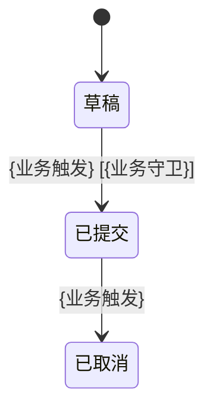

> 红骨架。规则讲解全部在 [`../references/`](../references/) 与 [`../../shared/contracts/`](../../shared/contracts/)。
> 增量标注 5 项闭集见 [`../references/increment-annotation.md`](../references/increment-annotation.md)；
> Diff / 迁移映射见 [`../references/diff-and-migration.md`](../references/diff-and-migration.md)；
> DMN 启用与去重见 [`../references/dmn-when-and-how.md`](../references/dmn-when-and-how.md)；
> AC 三层口径见 [`../../shared/contracts/ac-vocabulary.md`](../../shared/contracts/ac-vocabulary.md)；
> 字段语义见 [`../../shared/contracts/frontmatter-schema.md`](../../shared/contracts/frontmatter-schema.md)。

# {capability-name} Spec

## L0 业务上下文

- **业务目标**：{一句话业务价值}
- **关键场景**：{典型用户场景，1–3 条}
- **业务禁区**：{本能力不得越界做的事，作为 L4 DoD 守卫来源}
- **依赖业务能力**（每条带增量标注；`change_mode != greenfield` 时强制）：
  - `[已有·仅引用]` `{业务能力名}` —— 来源：`{既有 spec 路径}`
  - `[新增]` `{业务能力名}`
- **合规 / 政策约束**（每条带增量标注）：
  - `[已有·仅引用]` `{法规 / 行业规则名}`
- **关键术语**（每条带增量标注）：
  - `[新增]` "`{术语}`" = `{业务定义}`

### L0.x 既有上下文衔接（`change_mode != greenfield` 必填）

| 既有业务上下文 / Bounded Context | 关系类型 | 说明 |
|----------------------------------|---------|------|
| `{既有 BC / 既有业务流程名}` | 沿用 / 扩展 / 替代 / ACL 隔离 | `{一句话说明边界与契约}` |

## L1 用户故事

> 每条 US 必须显式声明 `关联 REQ`（多对多映射；可空但必须显式）；增量标注 5 项闭集见 [`../references/increment-annotation.md`](../references/increment-annotation.md)。

- `[新增]` **US-1**：作为 `{角色}`，我希望 `{目标}`，以便 `{价值}`。
  - **关联 REQ**：[AUTH-xx]
- `[已有·扩展]` **US-2**：作为 `{角色}`，我希望 `{新目标}`，以便 `{新价值}`。
  - **关联 REQ**：[AUTH-yy]
  - **既有 US 引用**：`specs/{既有}.md#US-x`
  - **扩展点**：{一句话说明扩展点}
- `[已有·修改]` **US-3**：……
  - **关联 REQ**：[AUTH-zz]
  - **既有 US 引用**：`specs/{既有}.md#US-x`
  - **变化点**：{原意图 → 新意图}

## L2 业务实体与规则（INV-x）

> 业务语言纯净（违禁词见 [`./l0-l4-guide.md`](../references/l0-l4-guide.md) §4）；增量标注强制（`change_mode != greenfield`）。

### 业务实体

- `[新增]` **`{订单}`**：用户向平台发起的一次购买请求
  - 关键业务属性：状态、金额、提交时间
- `[已有·扩展]` **`{用户}`**：本次新增"风险等级"业务属性
  - 既有引用：`specs/{既有}.md#实体-用户`
- `[已有·仅引用]` **`{商品}`**：本次不修改，仅作为订单项的关联对象

#### 实体属性 Diff 表（仅 `[已有·扩展]` 含新属性 / `[已有·修改]` 实体必填，写法见 [`../references/diff-and-migration.md`](../references/diff-and-migration.md) §1）

| 实体 | 属性名 | 原定义 | 新定义 | 影响下游 |
|------|--------|--------|--------|---------|
| `{用户}` | `风险等级` | —（不存在） | 枚举：低 / 中 / 高 | 触发 REQ-00x 的分流逻辑 |

### 业务关系

> 业务语言（"包含 / 归属 / 同生共死"），不写 `1:N / 聚合根`。

- `{订单}` **包含** `{订单项}`
- `{订单}` **归属于** `{用户}`

### 业务规则（INV-x） — 数据级 AC

- `[新增]` **INV-1**：{一条永真业务规则}
- `[已有·修改]` **INV-3**：
  - **原约束**：{原规则}
  - **新约束**：{新规则}
  - **与既有 INV 的兼容关系**：{取代 / 并存 / 收紧}
- `[已有·废弃]` **INV-7**：{原规则}
  - **迁移路径**：{由谁取代 / 旧用例改写指引}
  - **兼容期窗口**：{起始时机 → 终止时机}

### 业务流转（按需子项；启用条件见 [`./l0-l4-guide.md`](../references/l0-l4-guide.md) §扩展）

> 仅当业务实体存在 ≥ 2 业务阶段、或跨系统业务事件传递明确时启用。增量场景下只画本次新增 / 修改的阶段或转换。

#### 业务阶段流转（按需）



| 从 → 到 | 增量标注 | 业务触发 | 业务守卫 | 业务副作用 |
|---------|---------|---------|---------|-----------|
| `{阶段A}` → `{阶段B}` | `[新增]` | `{业务事件}` | `{业务条件}` | `{业务侧影响}` |

#### 业务属性生命周期（按需）

- `[新增]` `{实体}.{业务属性}`：业务快照 \| {何时定格} \| 不可变

#### 业务事件流（按需，仅跨系统 / 跨角色）

- `[新增]` `{触发方}` —[`{业务事件}`]→ `{感知方}` \| 异步 \| 幂等

## L3 行为规约（EARS + Gherkin）

> EARS 5 句式 + Gherkin Scenario 速查见 [`./ears-gherkin-cheatsheet.md`](../references/ears-gherkin-cheatsheet.md)。
> AC 编号 `AC-{req}-{seq}`；`req` = `related_req` 元素尾段。

### REQ-001 `[新增]` {需求标题}

> **关联 US**：US-1
> **EARS 模式**：事件驱动 / 状态驱动 / 普遍行为 / 可选特性 / 异常行为

**系统行为声明**：

> 系统应在 `{触发条件}` 时 `{精确动作，含约束：时限 / 格式 / 幂等}`。

```gherkin
Scenario: AC-001-01 — {正常路径场景名}
  Given {系统前置状态}
  When  {触发动作}
  Then  {可观察输出 / 状态变化}

Scenario: AC-001-02 — {异常路径场景名}
  Given {系统前置状态}
  When  {异常触发}
  Then  {降级 / 错误处理}
```

### REQ-002 `[已有·修改]` {需求标题}

> **关联 US**：US-3
> **EARS 模式**：{模式}
> **既有 REQ 引用**：`specs/{既有}.md#REQ-xx`

**行为 Diff**（写法见 [`../references/diff-and-migration.md`](../references/diff-and-migration.md) §2）：

| 维度 | 原行为声明 | 新行为声明 |
|------|-----------|-----------|
| 触发条件 | `{原}` | `{新}` |
| 系统动作 | `{原}` | `{新}` |
| 约束 | `{原}` | `{新}` |

**AC 迁移映射**（写法见 [`../references/diff-and-migration.md`](../references/diff-and-migration.md) §3，必填）：

| 既有 AC 编号 | 处理方式 | 新 AC 编号 | 备注 |
|-------------|---------|-----------|------|
| `AC-xx-yy` | 保留 / 修改 / 拆分 / 废弃 | `AC-002-01` | {一句话} |

```gherkin
Scenario: AC-002-01 — {场景名}
  Given {前置}
  When  {操作}
  Then  {预期}
```

### REQ-003 `[已有·扩展]` {需求标题}

> **关联 US**：US-2
> **EARS 模式**：{模式}
> **既有 REQ 引用**：`specs/{既有}.md#REQ-xx`
> **扩展点**：{一句话说明新增分支 / 场景，不改变既有 AC 判定}

```gherkin
Scenario: AC-003-01 — {新增场景名}
  Given {前置}
  When  {操作}
  Then  {预期}
```

### 决策模型 DMN（可选；启用判据 / 命中策略 / 与其他层去重见 [`../references/dmn-when-and-how.md`](../references/dmn-when-and-how.md)）

> 仅当命中 ≥ 2 条启用判据（多维交叉 / 业务高频变更 / 业务可读可改 / 审计追溯 / 跨场景复用）时嵌入；否则用 EARS + Gherkin 直写。
> 编号 `DMN-xxx`、行号 `DMN-xxx-Rn`、BKM-xxx；不与 `INV-x` / `AC-xxx-xx` 冲突。

#### DMN-001 `[新增]` {决策表标题}

> **关联 REQ**：REQ-xxx
> **命中策略**：U / C（推荐；禁用 F）
> **知识源**（可选）：指向 L0 合规约束中的政策文件名

| 规则号 | 增量标注 | 输入: `{维度1}` | 输入: `{维度2}` | 输入: `{维度3}` | 输出: `{结论字段}` | 业务备注 |
|--------|---------|----------------|----------------|----------------|-------------------|---------|
| R1 | `[新增]` | `"值A"` | `-` | `[0..100]` | `{值1}` | {一句业务备注} |
| R4（兜底） | `[新增]` | `-` | `-` | `-` | `{默认值}` | **未命中默认行（必备）** |

## L4 DoD（Definition of Done — 承接 AC 闭环）

> 不新增验收点（[`../../shared/contracts/ac-vocabulary.md`](../../shared/contracts/ac-vocabulary.md) §4）；只对 L2 INV / L3 Scenario / DMN-Rn 逐条闭环 + 工程闭环 + 增量闭环。

**功能级 AC**（对应 L3 每条 Scenario）：

- [ ] `AC-001-01` {场景名}：自动化测试通过
- [ ] `AC-002-01` {场景名}：自动化测试通过

**数据级 AC**（对应 L2 每条 INV-x）：

- [ ] `INV-1` {简述}：单元测试 / 类型约束 / 断言覆盖
- [ ] `INV-3` {简述}：断言 / 测试覆盖（含"原 → 新"迁移用例）

**规则级 AC**（仅启用 DMN 时填；未启用勾选"不适用"）：

- [ ] **不适用**（本 spec 未启用 DMN）
- [ ] `DMN-001` 决策表 R1..Rn 全部规则均有参数化测试覆盖
- [ ] `DMN-001` 已包含兜底行，无未命中分支抛错
- [ ] `DMN-001` 命中策略声明明确（推荐 `U` / `C`；未使用 `F`）

**交付级 AC**（工程闭环）：

- [ ] 类型检查 / lint / 构建通过
- [ ] 未触及 L0 业务禁区
- [ ] 与 L0 合规 / 政策约束一致

**增量闭环 AC**（`change_mode != greenfield` 必填；greenfield 勾"不适用"）：

- [ ] **不适用**（`change_mode: greenfield`）
- [ ] **既有 AC 复测**：所有 `[已有·扩展]` / `[已有·仅引用]` 触达的既有 AC 编号已全部回归通过（列编号）
- [ ] **AC 迁移完整性**：所有 `[已有·修改]` REQ 的"AC 迁移映射"中标"保留"的既有 AC 全部通过，"废弃"项代码中无残留引用
- [ ] **冲突护栏**：所有 `[已有·修改]` INV 的"原 → 新"已在数据 / 类型 / 断言中体现，旧约束无残留
- [ ] **调用方 / 下游通知**：`impacted_modules` 中列出的下游已通知或通过 ACL 隔离
- [ ] **兼容期 / 灰度 / 回滚**：proposal §2 Backout 中声明的策略已就位且可演练
- [ ] **`[已有·废弃]` 项**：迁移路径已落地，兼容期窗口公告已发布
- [ ] **双向链接**：本 spec 已在所有 `reference_specs` 中被反向引用

**账本握手**（与 RBK 协作）：

- [ ] frontmatter `related_req` 状态：非空（待 ship）/ 空（待 writeback）
- [ ] frontmatter `reference_specs` / `touched_capabilities` / `impacted_modules` 与 proposal §0 一致

---

## 附：极简模式（单一小功能 / Bug 修复可用）

> 当需求足够小，可将 L0–L4 压缩为五段最小卡片。上方完整结构与本卡片**择一使用**，不重复。
> frontmatter 字段位仍需保留（可为 `[]`，禁止删除字段）。`bugfix` / `extend` 模式下 `[CHANGE]` 段**强制必填**。

```
[WHY]    一句用户故事（L1）+ 业务禁区一行（L0 精简）+ 关联 REQ: [AUTH-xx]
[CHANGE] 动了既有什么 / 不动既有什么（列 reference_specs / impacted_modules 中的具体条目；纯新建写"无既有触达"）
[WHAT]   1-2 个业务实体 + 关键 INV-x（每条带增量标注）（L2）
[RULES]  决策表（可选；多条件交叉规则时；不启用写"无"）
[HOW]    EARS 一句 + 2-3 个 Gherkin（含 AC-xxx-xx 编号；修改既有 REQ 时附"原 → 新"一行）
[DONE]   勾选每条 AC-xxx-xx / INV-x / DMN-xxx-Rn 已通过 + 禁区未触及 + 既有 AC 已复测
```

---

## 附：避免过度设计核查清单

> 每次写完 spec 前逐项核对。任一答案"否"则**移除对应可选章节**；唯第 6 项答案"否"时**不可省略字段位**，须显式声明"无既有触达"以证明已主动思考。

| # | 检查项 | 不通过 → 处理 |
|---|--------|--------------|
| 1 | L2 业务流转：业务实体是否真有 ≥ 2 个业务阶段 / 跃迁？ | 否 → 删除业务阶段图 |
| 2 | L3 业务流程图：Scenario 是否 > 3 条 或 含多角色协作？ | 否 → 删除流程图 |
| 3 | L3 DMN：规则维度是否 ≥ 3 且 变更主导方是业务？ | 否 → 用 Gherkin 直写，移除 DMN 子项 |
| 4 | L3 DMN BKM：该公式是否被 ≥ 2 个决策复用？ | 否 → 内联到决策表结论列，移除 BKM |
| 5 | 任何子项内容是否已在其他层出现过？ | 是 → 删除重复，改为引用编号 |
| 6 | frontmatter 增量字段（`change_mode` / `reference_specs` / `touched_capabilities` / `impacted_modules`）是否已显式声明？ | 否 → **不可省略字段位**，至少写 `[]` 或"无既有触达" |

> **黄金准则**：
>
> - **能用上一层简单形态表达的，绝不开下一层复杂工具。** 可选章节不是"加分项"，而是"应急工具"。
> - **能复用既有资产的，绝不另起炉灶。** 凡涉及既有内容必须显式引用、显式标注关系。
> - **DMN 收敛后主动回退**：业务规则收敛稳定且维度退化到 ≤ 2 时，主动回退为 Gherkin / INV（详见 [`../references/dmn-when-and-how.md`](../references/dmn-when-and-how.md) §9）。

---

## 增量标注图例（5 项闭集）

- `[新增]`：本次 change 首次引入
- `[已有·仅引用]`：复用既有，无修改（仅追溯，不进 `related_req`）
- `[已有·扩展]`：既有基础上扩展，需显式给出**扩展点**
- `[已有·修改]`：既有语义变化，需配套 Diff 表（[`../references/diff-and-migration.md`](../references/diff-and-migration.md)）
- `[已有·废弃]`：既有停用，需给出**迁移路径** + **兼容期窗口**